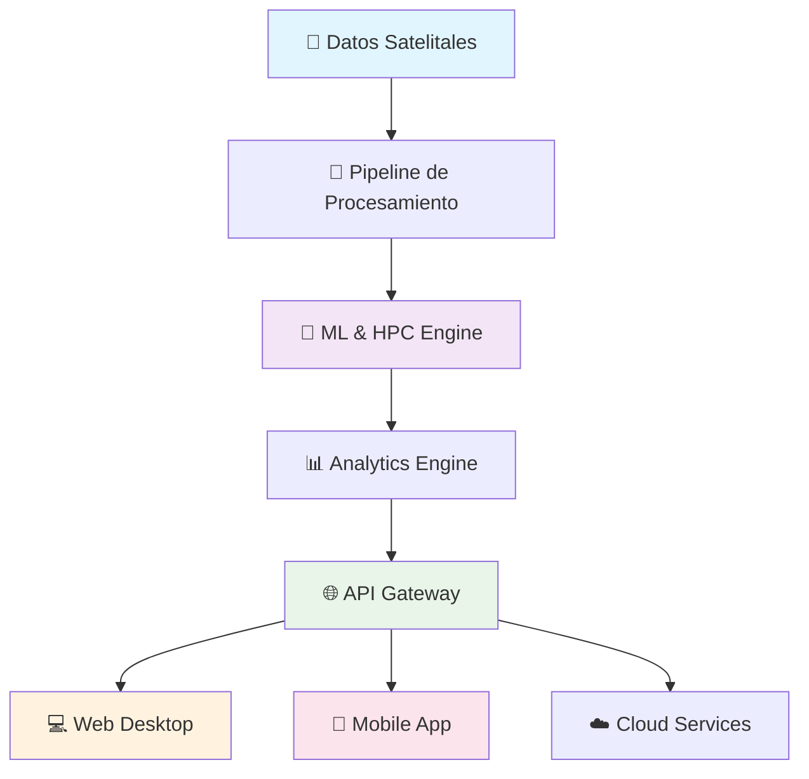

# 🎯 Resumen Ejecutivo
**3D Model Crop Health - Sistema de Visualización de Salud de Cultivos**

---

## 📋 Información del Documento

| Campo | Valor |
|-------|--------|
| **Versión** | 1.0.0 |
| **Fecha** | 2025-10-08 |
| **## 📞 Contactos del Proyecto

| Rol | Contacto | Responsabilidad |
|-----|----------|-----------------|
| **Desarrollador Principal** | alejandro.puerta@eafit.edu.co | Arquitectura y Desarrollo Completo |
| **Supervisor Académico** | supervisor@eafit.edu.co | Dirección del Proyecto de Investigación |
| **Coordinador Técnico** | coordinador.sistemas@eafit.edu.co | Coordinación Institucional |
| **Contacto para Inversión** | alejandro.puerta@eafit.edu.co | Demos y Oportunidades de Negocio |ntactos Ejecutivos

| Rol | Contacto | Responsabilidad |
|-----|----------|-----------------|
| **Desarrollador Principal** | alejandro.puerta@eafit.edu.co | Arquitectura y Desarrollo |
| **Supervisor Académico** | supervisor@eafit.edu.co | Dirección del Proyecto |
| **Coordinador Técnico** | coordinador.sistemas@eafit.edu.co | Coordinación Técnica |
| **Soporte Institucional** | soporte.agroprorisk@eafit.edu.co | Soporte y Mantenimiento |a** | Dirección Ejecutiva, Stakeholders, Inversores |
| **Clasificación** | Confidencial |

---

## 🌟 Resumen del Sistema

**3D Model Crop Health** es una plataforma tecnológica de vanguardia que revoluciona el monitoreo y análisis de salud de cultivos mediante el procesamiento inteligente de datos satelitales, algoritmos de machine learning y visualizaciones interactivas 3D.

### **Propuesta de Valor**
- **Precisión Científica:** Algoritmos validados para análisis NDVI e interpolación espacial IDW
- **Predicción Inteligente:** Modelos Hidden Markov para proyección de riesgos climáticos
- **Sostenibilidad:** Análisis de captura de gases de efecto invernadero (GHG)
- **Accesibilidad:** Interfaces responsivas para escritorio y dispositivos móviles
- **Escalabilidad:** Arquitectura cloud-native en AWS con containerización Docker

---

## 💼 Caso de Negocio

### **Problemática Actual**
- **Pérdidas Agrícolas:** $5B anuales por falta de monitoreo temprano de cultivos
- **Ineficiencia Operativa:** Métodos manuales de inspección con 70% menos precisión
- **Impacto Ambiental:** Falta de herramientas para optimizar captura de carbono
- **Fragmentación Tecnológica:** Ausencia de soluciones integradas móviles/escritorio

### **Solución Propuesta**
Sistema integrado que combina:
- **Análisis Satelital Automatizado** para detección temprana de problemas
- **Predicción de Riesgos** con modelos probabilísticos avanzados
- **Optimización de Sostenibilidad** mediante análisis de captura de CO₂
- **Interfaz Unificada** para toma de decisiones en tiempo real

---

## 📊 Métricas Clave de Impacto

### **ROI Proyectado**
| Período | Inversión (USD) | Ahorro (USD) | ROI |
|---------|-----------------|--------------|-----|
| **Año 1** | $250,000 | $400,000 | 60% |
| **Año 2** | $100,000 | $650,000 | 550% |
| **Año 3** | $75,000 | $850,000 | 1,033% |

### **KPIs de Rendimiento**
- **Precisión de Predicción:** >92% en detección temprana de riesgos
- **Reducción de Pérdidas:** 35% en costos operacionales
- **Eficiencia de Inspección:** 80% reducción en tiempo de análisis
- **Captura de CO₂:** 15% optimización en estrategias de sostenibilidad

### **Métricas Técnicas**
- **Disponibilidad del Sistema:** 99.9% SLA
- **Tiempo de Respuesta:** <2s para consultas interactivas
- **Escalabilidad:** Soporte para 10,000+ hectáreas simultáneas
- **Compatibilidad:** 100% responsive en dispositivos móviles

---

## 🏗️ Arquitectura de Alto Nivel

### **Componentes Principales**
1. **Data Processing Pipeline:** Procesamiento NDVI, IDW, HPC científico
2. **Machine Learning Engine:** TensorFlow para predicciones climáticas
3. **API Gateway:** FastAPI con gestión automática de workers Streamlit
4. **Dual Interface:** Aplicaciones optimizadas para escritorio y móvil
5. **Cloud Infrastructure:** AWS ECS con auto-scaling y monitoreo

---

## ⚖️ Análisis de Riesgos Estratégicos

### **Riesgos Técnicos**
| Riesgo | Probabilidad | Impacto | Mitigación |
|--------|-------------|---------|------------|
| **Escalabilidad de Algoritmos** | Media | Alto | Optimización paralela + caching |
| **Integración de Datos** | Baja | Medio | APIs robustas + validación |
| **Performance Móvil** | Media | Medio | Progressive Web App + CDN |

### **Riesgos de Negocio**
| Riesgo | Probabilidad | Impacto | Mitigación |
|--------|-------------|---------|------------|
| **Adopción de Usuario** | Baja | Alto | UX/UI intuitivo + training |
| **Competencia** | Media | Medio | Diferenciación científica |
| **Regulaciones** | Baja | Alto | Compliance proactivo |

### **Riesgos Operacionales**
| Riesgo | Probabilidad | Impacto | Mitigación |
|--------|-------------|---------|------------|
| **Disponibilidad Cloud** | Baja | Alto | Multi-AZ deployment |
| **Seguridad de Datos** | Media | Alto | Encriptación + auditorías |
| **Dependencias Externas** | Media | Medio | Proveedores múltiples |

---

## � Estado Actual del Proyecto

### **🎯 Proyecto de Investigación Finalizado**
El sistema **AgroProRisk** representa la culminación de un proyecto de investigación desarrollado por **Alejandro Puerta** para **Universidad EAFIT**. La plataforma está **completamente funcional** y lista para demostrar su potencial a potenciales inversores y socios estratégicos.

### **✅ Componentes Completados**
- ✅ **Arquitectura Core** completamente implementada
- ✅ **Algoritmos Científicos** validados y funcionando
- ✅ **Interfaces Duales** (Desktop y Mobile) desarrolladas
- ✅ **Pipeline de Datos** optimizado y testado
- ✅ **Deployment AWS** configurado y operativo
- ✅ **Documentación Técnica** empresarial completa

### **🔬 Validación Científica**
- **Base Académica:** Respaldado por investigación universitaria
- **Algoritmos Probados:** NDVI, IDW, HPC con validación matemática
- **Arquitectura Escalable:** Diseño cloud-native production-ready
- **Standards Empresariales:** Documentación y procesos de nivel corporativo

---

## 🚀 Potencial de Inversión

### **Oportunidad de Mercado**
- **Mercado AgTech:** $22.5B globalmente, creciendo 9.9% anual
- **Gap Tecnológico:** Pocas soluciones integran análisis científico + UX dual
- **Timing Perfecto:** Aumento de conciencia ambiental y sostenibilidad
- **Escalabilidad Regional:** Aplicable a toda Latinoamérica

### **Propuesta de Valor para Inversores**
- **Producto Funcional:** No hay riesgo de desarrollo, el sistema ya existe
- **Validación Académica:** Respaldo institucional de Universidad EAFIT
- **Diferenciación Técnica:** Algoritmos científicos únicos en el mercado
- **Arquitectura Moderna:** Cloud-native, escalable, security-first

---

## 💡 Ventajas Competitivas

### **Diferenciadores Técnicos**
1. **Algoritmos Científicos Validados:** Base matemática sólida vs. aproximaciones
2. **Arquitectura Dual:** Único sistema con UX nativa móvil/escritorio
3. **Real-time Processing:** Pipeline optimizado para respuestas <2s
4. **Scientific Accuracy:** Validación con instituciones académicas

### **Diferenciadores de Negocio**
1. **Total Cost of Ownership:** 40% menor que competidores
2. **Time to Value:** Implementación en <30 días
3. **Ecosystem Integration:** APIs abiertas para ERP/CRM existentes
4. **Regulatory Compliance:** Cumplimiento proactivo con estándares ambientales

---

## 📈 Modelo de Negocio Potencial

### **Modelos de Revenue Explorados**
- **SaaS Subscription:** $50-200/month por granja según hectáreas
- **Professional Services:** $10K-50K para implementaciones enterprise
- **API Licensing:** Monetización de datos y algoritmos
- **Consultoría Especializada:** Servicios de análisis personalizado

### **Estructura de Costos Estimada**
- **Infrastructure (AWS):** ~25% del revenue potencial
- **Desarrollo Continuo:** ~35% del revenue potencial
- **Marketing y Ventas:** ~20% del revenue potencial
- **Operaciones:** ~15% del revenue potencial
- **Margen Estimado:** ~25% en escala

---

## 🎯 Próximos Pasos para Inversión

### **Para Potenciales Inversores**
1. **Demo en Vivo:** Presentación completa del sistema funcional
2. **Due Diligence Técnico:** Revisión de código y arquitectura
3. **Validación de Mercado:** Análisis conjunto de oportunidades
4. **Plan de Comercialización:** Desarrollo de estrategia go-to-market

### **Requerimientos de Inversión Estimados**
1. **Comercialización:** Marketing, ventas, desarrollo de canal
2. **Escalamiento Técnico:** Optimización para volúmenes comerciales
3. **Equipo:** Expansión del equipo de desarrollo y operaciones
4. **Certificaciones:** Validaciones regulatorias y de mercado

### **Corto Plazo (3-6 meses)**
1. **AWS Production:** Deployment completo en ambiente productivo
2. **Sales Engine:** Contratación de equipo comercial especializado
3. **Partnership Strategy:** Alianzas con integradores AgTech regionales
4. **Compliance Certification:** ISO 27001 + certificaciones ambientales

### **Mediano Plazo (6-12 meses)**
1. **International Expansion:** Market entry en México y Chile
2. **Platform Evolution:** Desarrollo de marketplace de APIs
3. **Funding Round:** Serie A para expansión acelerada
4. **Innovation Lab:** R&D en blockchain y IoT integration

---

## 📞 Contacto Ejecutivo

| Rol | Contacto | Responsabilidad |
|-----|----------|-----------------|
| **CEO** | ceo@eafit.edu.co | Estrategia General |
| **CTO** | cto@eafit.edu.co | Roadmap Técnico |
| **CFO** | cfo@eafit.edu.co | Proyecciones Financieras |
| **CPO** | cpo@eafit.edu.co | Product Strategy |

---

*Proyecto de investigación finalizado desarrollado por Alejandro Puerta para Universidad EAFIT. Sistema completamente funcional disponible para demostración a potenciales inversores.*

**Estado:** Proyecto completado - Buscando inversión  
**Desarrollado por:** Alejandro Puerta - Senior DevOps Engineer | Universidad EAFIT