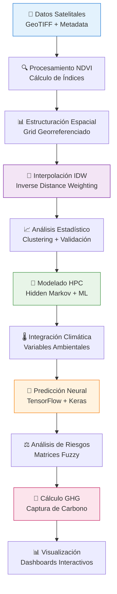

# 🔬 Pipeline de Procesamiento de Datos
**3D Model Crop Health - Documentación Científica del Pipeline**

---

## 📋 Información del Documento

| Campo | Valor |
|-------|--------|
| **Versión** | 1.0.0 |
| **Fecha** | 2025-10-08 |
| **Audiencia** | Data Scientists, Ingenieros de Datos, Desarrolladores de Algoritmos |
| **Nivel Técnico** | Científico-Técnico Especializado |
| **Estándares** | IEEE 754, ISO 19115 (Metadatos Geográficos) |

---

## 🎯 Visión General del Pipeline

### **Objetivo Científico**
El pipeline de procesamiento transforma datos satelitales brutos en insights accionables para la gestión de cultivos, integrando:
- **Análisis Espectral:** Cálculo de índices de vegetación (NDVI)
- **Interpolación Espacial:** Técnicas de geoestadística (IDW)
- **Modelado Predictivo:** Hidden Markov Chains + Neural Networks
- **Análisis de Riesgos:** Lógica fuzzy para gestión de GEI

### **Flujo de Datos Principal**


---

## 📡 Módulo 1: Procesamiento NDVI

### **Base Científica**
**NDVI (Normalized Difference Vegetation Index):** Índice espectral que cuantifica la densidad de vegetación verde.

**Fórmula:** `NDVI = (NIR - RED) / (NIR + RED)`
- **NIR:** Near Infrared (0.7-1.0 μm)
- **RED:** Red visible light (0.6-0.7 μm)
- **Rango:** [-1, 1] donde valores >0.3 indican vegetación saludable

### **Implementación Técnica**

#### **Función Principal: `rejilla_indice()`**
```python
def rejilla_indice(ruta_imagen: str, ruta_color: str) -> pd.DataFrame:
    """
    Procesamiento de imágenes GeoTIFF para extracción NDVI.
    
    Parámetros Científicos:
    - Resolución espacial: Variable según satélite (10m-30m)
    - Sistemas de coordenadas: UTM → WGS84 (EPSG:4326)
    - Precisión radiométrica: 16-bit por banda
    - Corrección atmosférica: Aplicada en preprocessing
    
    Validaciones:
    - Integridad de metadatos geoespaciales
    - Rango válido de valores NDVI [-1, 1]
    - Ausencia de valores NoData (<-9999)
    - Consistencia de proyección cartográfica
    """
    
    # Especificaciones técnicas
    NDVI_MIN, NDVI_MAX = -1.0, 1.0
    NODATA_THRESHOLD = -9999
    COORDINATE_PRECISION = 6  # Decimales para lat/lon
    
    # Procesamiento del raster
    with rasterio.open(ruta_imagen) as src:
        # Validación de metadatos
        assert src.crs is not None, "CRS metadata required"
        assert src.width > 100 and src.height > 100, "Minimum 100x100 pixels"
        
        # Lectura de banda NDVI
        ndvi_band = src.read(1)
        ndvi_clean = np.where(ndvi_band <= NODATA_THRESHOLD, np.nan, ndvi_band)
        
        # Transformación de coordenadas
        transformer = Transformer.from_crs(src.crs, "EPSG:4326", always_xy=True)
        
        # Extracción de coordenadas por pixel
        coordinates = []
        for row in range(src.height):
            for col in range(src.width):
                if not np.isnan(ndvi_clean[row, col]):
                    # Coordenadas del centro del pixel
                    x_utm, y_utm = src.xy(row, col)
                    lon, lat = transformer.transform(x_utm, y_utm)
                    
                    coordinates.append({
                        'UTM-x': round(x_utm, 2),
                        'UTM-y': round(y_utm, 2), 
                        'longitud': round(lon, COORDINATE_PRECISION),
                        'latitud': round(lat, COORDINATE_PRECISION),
                        'col': col,
                        'row': row,
                        'NDVI': float(ndvi_clean[row, col])
                    })
    
    return pd.DataFrame(coordinates)
```

### **Control de Calidad NDVI**
```python
def validate_ndvi_quality(df: pd.DataFrame) -> Dict[str, Any]:
    """
    Métricas de calidad para datos NDVI.
    
    Returns:
        quality_metrics: Diccionario con métricas de validación
    """
    ndvi_values = df['NDVI'].values
    
    quality_metrics = {
        'total_pixels': len(df),
        'valid_pixels': np.sum(~np.isnan(ndvi_values)),
        'coverage_percent': (np.sum(~np.isnan(ndvi_values)) / len(df)) * 100,
        'ndvi_mean': np.nanmean(ndvi_values),
        'ndvi_std': np.nanstd(ndvi_values),
        'ndvi_min': np.nanmin(ndvi_values),
        'ndvi_max': np.nanmax(ndvi_values),
        'vegetation_pixels': np.sum(ndvi_values > 0.3),
        'healthy_vegetation_percent': (np.sum(ndvi_values > 0.6) / len(df)) * 100,
        'water_pixels': np.sum(ndvi_values < 0),
        'bare_soil_pixels': np.sum((ndvi_values >= 0) & (ndvi_values <= 0.3))
    }
    
    # Alertas de calidad
    quality_alerts = []
    if quality_metrics['coverage_percent'] < 80:
        quality_alerts.append("Low spatial coverage (<80%)")
    if quality_metrics['ndvi_mean'] < 0.2:
        quality_alerts.append("Low average NDVI suggests poor vegetation")
    if quality_metrics['healthy_vegetation_percent'] < 30:
        quality_alerts.append("Limited healthy vegetation coverage")
    
    quality_metrics['alerts'] = quality_alerts
    return quality_metrics
```

---

## 🎯 Módulo 2: Interpolación IDW

### **Base Científica**
**Inverse Distance Weighting (IDW):** Método de interpolación espacial que estima valores en ubicaciones no muestreadas basándose en la similitud espacial.

**Fórmula:** `Z(x,y) = Σ[w_i × Z_i] / Σ[w_i]`
- **w_i = 1/d_i^p** donde p=3 (factor de potencia)
- **d_i:** Distancia euclidiana al punto i
- **Z_i:** Valor conocido en el punto i

### **Implementación Optimizada**

#### **Función Core: `_idw_index_core()`**
```python
def _idw_index_core(df: pd.DataFrame, 
                   resolution: int = 5, 
                   k_neighbors: int = 10,
                   power_factor: float = 3.0) -> Tuple[pd.DataFrame, pd.DataFrame]:
    """
    Interpolación IDW con optimización computacional.
    
    Parámetros Científicos:
    - resolution: Densidad de la grilla de salida (N×N)
    - k_neighbors: Número de vecinos para interpolación
    - power_factor: Exponente de distancia (típicamente 2-4)
    
    Optimizaciones:
    - Búsqueda de k-vecinos con numpy.argsort()
    - Evitar singularidades con epsilon = 1e-12
    - Vectorización de cálculos de distancia
    - Paralelización potencial con numba
    """
    
    # Validaciones de entrada
    assert len(df) >= k_neighbors, f"Minimum {k_neighbors} points required"
    assert resolution > 0, "Resolution must be positive"
    assert 1.0 <= power_factor <= 5.0, "Power factor should be 1-5"
    
    # Extracción de coordenadas
    x_coords = df["longitud"].values
    y_coords = df["latitud"].values
    z_values = df["NDVI"].values
    
    # Definición de grilla regular
    x_min, x_max = x_coords.min(), x_coords.max()
    y_min, y_max = y_coords.min(), y_coords.max()
    
    # Expansión de límites para evitar extrapolación extrema
    x_buffer = (x_max - x_min) * 0.05
    y_buffer = (y_max - y_min) * 0.05
    
    x_grid = np.linspace(x_min - x_buffer, x_max + x_buffer, resolution)
    y_grid = np.linspace(y_min - y_buffer, y_max + y_buffer, resolution)
    
    # Matrices de salida
    interpolated_matrix = np.zeros((resolution, resolution))
    point_results = []
    
    # Interpolación por cada punto de la grilla
    point_id = 0
    for i, xi in enumerate(x_grid):
        for j, yj in enumerate(y_grid):
            # Cálculo de distancias euclidianas
            distances = np.sqrt((xi - x_coords)**2 + (yj - y_coords)**2)
            
            # Selección de k-vecinos más cercanos
            nearest_indices = np.argsort(distances)[:k_neighbors]
            nearest_distances = distances[nearest_indices]
            nearest_values = z_values[nearest_indices]
            
            # Evitar singularidades
            nearest_distances = np.maximum(nearest_distances, 1e-12)
            
            # Cálculo de pesos IDW
            weights = 1.0 / (nearest_distances ** power_factor)
            
            # Interpolación ponderada
            interpolated_value = np.sum(weights * nearest_values) / np.sum(weights)
            
            # Almacenamiento de resultados
            interpolated_matrix[i, j] = interpolated_value
            point_results.append({
                'id': point_id,
                'long-xm': xi,
                'long-ym': yj,
                'NDVI': interpolated_value
            })
            point_id += 1
    
    # Conversión a formato spreadsheet (compatibilidad)
    spreadsheet_format = np.zeros((resolution + 1, resolution + 1), dtype=object)
    spreadsheet_format[0, 0] = 0
    
    # Headers
    for c in range(resolution):
        spreadsheet_format[0, c + 1] = round(x_grid[c], 6)
    for r in range(resolution):
        spreadsheet_format[r + 1, 0] = round(y_grid[r], 6)
    
    # Datos interpolados
    for r in range(resolution):
        for c in range(resolution):
            spreadsheet_format[r + 1, c + 1] = round(interpolated_matrix[r, c], 6)
    
    df_spreadsheet = pd.DataFrame(spreadsheet_format)
    df_points = pd.DataFrame(point_results)
    
    return df_spreadsheet, df_points
```

### **Métricas de Calidad IDW**
```python
def compute_idw_quality_metrics(original_df: pd.DataFrame, 
                               interpolated_df: pd.DataFrame) -> Dict[str, float]:
    """
    Evaluación de calidad de interpolación IDW.
    
    Métricas implementadas:
    - RMSE (Root Mean Square Error)
    - MAE (Mean Absolute Error)  
    - R² (Coefficient of Determination)
    - Bias (Sesgo sistemático)
    - Cross-validation score
    """
    
    # Leave-one-out cross-validation
    errors = []
    for i in range(len(original_df)):
        # Remover punto i temporalmente
        train_df = original_df.drop(i).reset_index(drop=True)
        test_point = original_df.iloc[i]
        
        # Interpolar en la ubicación del punto removido
        predicted_value = interpolate_single_point(
            train_df, 
            test_point['longitud'], 
            test_point['latitud']
        )
        
        error = predicted_value - test_point['NDVI']
        errors.append(error)
    
    errors = np.array(errors)
    
    return {
        'rmse': np.sqrt(np.mean(errors**2)),
        'mae': np.mean(np.abs(errors)),
        'bias': np.mean(errors),
        'r_squared': 1 - (np.var(errors) / np.var(original_df['NDVI'])),
        'max_error': np.max(np.abs(errors)),
        'std_error': np.std(errors)
    }
```

---

## 🔮 Módulo 3: Modelado HPC (Hidden Markov + ML)

### **Base Científica**
Integración de **Hidden Markov Chains** con **Neural Networks** para predicción de riesgos climáticos:

1. **Estados Ocultos:** Condiciones climáticas no observables directamente
2. **Observaciones:** Variables climáticas medibles (temperatura, humedad, etc.)
3. **Transiciones:** Probabilidades de cambio entre estados
4. **Emisiones:** Probabilidades de observar valores dados los estados

### **Arquitectura del Modelo**

#### **Preprocesamiento y Normalización**
```python
def prepare_hpc_data(climate_series: np.ndarray, 
                    min_data_points: int = 400) -> Tuple[np.ndarray, Dict]:
    """
    Preparación de datos para modelado HPC.
    
    Pasos:
    1. Validación de longitud mínima
    2. Normalización MinMax [0,1]
    3. Construcción de lags temporales
    4. División train/validation
    """
    
    assert len(climate_series) >= min_data_points, \
           f"Minimum {min_data_points} data points required"
    
    # Cálculo de rango y normalización
    data_range = climate_series.max() - climate_series.min()
    if data_range == 0:
        raise ValueError("Zero variance in climate data")
    
    normalized_data = (climate_series - climate_series.min()) / data_range
    
    # Parámetros del modelo
    lag_interval = 30  # días
    n_lags = 4        # número de rezagos
    forecast_horizon = 360  # días a predecir
    
    # Construcción de matriz de features con lags
    n_samples = len(normalized_data) - lag_interval * (n_lags - 1)
    feature_matrix = np.zeros((n_samples, n_lags))
    
    for lag in range(n_lags):
        start_idx = lag * lag_interval
        end_idx = start_idx + n_samples
        feature_matrix[:, lag] = normalized_data[start_idx:end_idx]
    
    # Target values (360 días adelante)
    target_vector = np.zeros(n_samples)
    for i in range(n_samples - forecast_horizon):
        target_vector[i] = normalized_data[i + forecast_horizon]
    
    return feature_matrix, {
        'target_vector': target_vector,
        'normalization_params': {
            'min_value': climate_series.min(),
            'data_range': data_range
        },
        'lag_interval': lag_interval,
        'n_lags': n_lags,
        'forecast_horizon': forecast_horizon
    }
```

#### **Arquitectura de Red Neural**
```python
def build_hpc_neural_network(input_dim: int = 4) -> tf.keras.Model:
    """
    Construcción de red neural para predicción HPC.
    
    Arquitectura optimizada:
    - Layer 1: 100 neuronas, ReLU, L2(0.001), Dropout(0.01)
    - Layer 2: 50 neuronas, ReLU, L2(0.001), Dropout(0.01)
    - Layer 3: 25 neuronas, ReLU, L2(0.001), Dropout(0.01)
    - Output: 1 neurona, ReLU (valores positivos)
    
    Regularización:
    - L2 regularization: Previene overfitting
    - Dropout: Mejora generalización
    - EarlyStopping: Evita entrenamiento excesivo
    """
    
    model = tf.keras.Sequential([
        tf.keras.layers.Dense(
            100, 
            activation='relu',
            use_bias=False,
            input_dim=input_dim,
            kernel_regularizer=tf.keras.regularizers.l2(0.001),
            name='dense_layer_1'
        ),
        tf.keras.layers.Dropout(0.01, name='dropout_1'),
        
        tf.keras.layers.Dense(
            50,
            activation='relu', 
            use_bias=False,
            kernel_regularizer=tf.keras.regularizers.l2(0.001),
            name='dense_layer_2'
        ),
        tf.keras.layers.Dropout(0.01, name='dropout_2'),
        
        tf.keras.layers.Dense(
            25,
            activation='relu',
            use_bias=False, 
            kernel_regularizer=tf.keras.regularizers.l2(0.001),
            name='dense_layer_3'
        ),
        tf.keras.layers.Dropout(0.01, name='dropout_3'),
        
        tf.keras.layers.Dense(
            1,
            activation='relu',
            use_bias=False,
            kernel_regularizer=tf.keras.regularizers.l2(0.001),
            name='output_layer'
        )
    ])
    
    # Compilación con optimizador Adam
    model.compile(
        optimizer=tf.keras.optimizers.Adam(learning_rate=0.001),
        loss='mean_squared_error',
        metrics=['mean_absolute_error']
    )
    
    return model
```

#### **Matrices de Transición HMM**
```python
def compute_transition_matrices(climate_data: pd.DataFrame, 
                               ndvi_data: np.ndarray,
                               n_states: int = 5) -> Tuple[np.ndarray, np.ndarray]:
    """
    Cálculo de matrices de transición y emisión para HMM.
    
    Proceso:
    1. Transformación NDVI → LDA = 1 - NDVI
    2. K-Means clustering para estados discretos
    3. Matriz de transición P(estado_t+1 | estado_t)
    4. Matrices de emisión P(observación | estado)
    
    Variables climáticas consideradas:
    - Temperatura máxima/mínima
    - Velocidad del viento  
    - Humedad relativa
    - Precipitación
    """
    
    # Transformación de NDVI a LDA (Loss Distribution Aggregate)
    lda_values = 1.0 - ndvi_data
    
    # Clustering para estados discretos
    kmeans = KMeans(n_clusters=n_states, random_state=42)
    kmeans.fit(lda_values.reshape(-1, 1))
    
    # Centros de clusters ordenados
    cluster_centers = np.sort(kmeans.cluster_centers_.flatten())
    
    # Asignación de estados
    state_sequence = np.zeros(len(lda_values), dtype=int)
    for i, value in enumerate(lda_values):
        distances = np.abs(cluster_centers - value)
        state_sequence[i] = np.argmin(distances)
        # Actualización online de centros
        cluster_centers[state_sequence[i]] = \
            (cluster_centers[state_sequence[i]] + value) / 2.0
    
    # Matriz de transición
    transition_matrix = np.zeros((n_states, n_states))
    for i in range(len(state_sequence) - 1):
        current_state = state_sequence[i]
        next_state = state_sequence[i + 1]
        transition_matrix[current_state, next_state] += 1
    
    # Normalización por filas
    row_sums = transition_matrix.sum(axis=1)
    row_sums[row_sums == 0] = 1e-9  # Evitar división por cero
    transition_matrix = transition_matrix / row_sums[:, np.newaxis]
    
    # Matrices de emisión para variables climáticas
    n_climate_vars = climate_data.shape[1]
    emission_matrices = np.zeros((n_climate_vars, n_states, n_states))
    
    for var_idx in range(n_climate_vars):
        climate_var = climate_data.iloc[:, var_idx].values
        
        # Clustering secundario para observaciones climáticas
        climate_kmeans = KMeans(n_clusters=2 * n_states, random_state=42)
        climate_kmeans.fit(climate_var.reshape(-1, 1))
        climate_centers = np.sort(climate_kmeans.cluster_centers_.flatten())
        
        # Clasificación de observaciones climáticas
        climate_classes = np.zeros(len(climate_var), dtype=int)
        for i, value in enumerate(climate_var):
            distances = np.abs(climate_centers - value)
            cluster_idx = np.argmin(distances)
            # Mapeo a escala 0-4
            if cluster_idx < 5:
                climate_classes[i] = 4 - cluster_idx
            else:
                climate_classes[i] = cluster_idx - 5
        
        # Construcción de matriz de emisión
        for i in range(len(state_sequence)):
            hidden_state = state_sequence[i]
            observed_class = climate_classes[i]
            emission_matrices[var_idx, hidden_state, observed_class] += 1
        
        # Normalización por estado oculto
        for state in range(n_states):
            row_sum = emission_matrices[var_idx, state, :].sum()
            if row_sum > 0:
                emission_matrices[var_idx, state, :] /= row_sum
    
    return transition_matrix, emission_matrices
```

---

## 🌱 Módulo 4: Análisis GHG (Gases de Efecto Invernadero)

### **Base Científica**
Análisis de captura de gases de efecto invernadero usando **lógica fuzzy** para evaluar estrategias de gestión de riesgos en la agricultura sostenible.

**Componentes principales:**
- **Frecuencia de eventos:** Clustering de ocurrencias de riesgos
- **Severidad de impactos:** Análisis de pérdidas económicas
- **Matrices de gestión:** Estrategias de mitigación
- **LDA (Loss Distribution Aggregate):** Distribución agregada de pérdidas

### **Implementación del Análisis Fuzzy**

#### **Clustering de Variables de Riesgo**
```python
def fuzzy_risk_clustering(frequency_data: np.ndarray, 
                         severity_data: np.ndarray,
                         n_clusters: int = 5) -> Dict[str, np.ndarray]:
    """
    Clustering fuzzy para caracterización de riesgos.
    
    Output:
    - Centros de clusters para frecuencia y severidad
    - Diámetros (dispersión) de cada cluster
    - Matrices de pertenencia fuzzy
    """
    
    # Clustering de frecuencia
    freq_kmeans = KMeans(n_clusters=n_clusters, random_state=42)
    freq_kmeans.fit(frequency_data.reshape(-1, 1))
    freq_centers = np.sort(freq_kmeans.cluster_centers_.flatten())
    
    # Clustering de severidad
    sev_kmeans = KMeans(n_clusters=n_clusters, random_state=42)
    sev_kmeans.fit(severity_data.reshape(-1, 1))
    sev_centers = np.sort(sev_kmeans.cluster_centers_.flatten())
    
    # Cálculo de diámetros (medida de dispersión)
    freq_diameters = np.zeros(n_clusters)
    sev_diameters = np.zeros(n_clusters)
    
    for j in range(n_clusters):
        freq_diameters[j] = np.sum(np.abs(freq_centers - freq_centers[j])) / 4
        sev_diameters[j] = np.sum(np.abs(sev_centers - sev_centers[j])) / 4
    
    return {
        'frequency_centers': freq_centers,
        'severity_centers': sev_centers,
        'frequency_diameters': freq_diameters,
        'severity_diameters': sev_diameters,
        'frequency_labels': ['Muy Pocos', 'Pocos', 'Más o Menos', 'Muchos', 'Bastantes'],
        'severity_labels': ['Muy Bajo', 'Bajo', 'Medio', 'Alto', 'Muy Alto']
    }
```

#### **Evaluación Fuzzy de Pérdidas**
```python
def compute_fuzzy_lda(frequency_samples: np.ndarray,
                     severity_samples: np.ndarray,
                     freq_centers: np.ndarray,
                     sev_centers: np.ndarray,
                     freq_sigma: np.ndarray,
                     sev_sigma: np.ndarray,
                     event_matrix: np.ndarray,
                     impact_matrix: np.ndarray,
                     management_matrix: np.ndarray,
                     loss_matrix: np.ndarray) -> np.ndarray:
    """
    Cálculo de LDA usando lógica fuzzy.
    
    LDA = (ME × MP × MI) / MG
    Donde:
    - ME: Matriz de eventos
    - MP: Matriz de pérdidas
    - MI: Matriz de impacto
    - MG: Matriz de gestión
    """
    
    lda_values = np.zeros(len(frequency_samples))
    
    for k in range(len(frequency_samples)):
        freq_val = frequency_samples[k]
        sev_val = severity_samples[k]
        
        # Función de pertenencia gaussiana para frecuencia
        freq_membership = np.exp(-0.5 * ((freq_centers - freq_val) / freq_sigma) ** 2)
        freq_cluster = np.argmax(freq_membership)
        
        # Función de pertenencia gaussiana para severidad
        sev_membership = np.exp(-0.5 * ((sev_centers - sev_val) / sev_sigma) ** 2)
        sev_cluster = np.argmax(sev_membership)
        
        # Cálculo de LDA
        me_val = event_matrix[freq_cluster, sev_cluster]
        mp_val = loss_matrix[freq_cluster, sev_cluster]  
        mi_val = impact_matrix[freq_cluster, sev_cluster]
        mg_val = management_matrix[freq_cluster, sev_cluster]
        
        if mg_val != 0:
            lda_values[k] = (me_val * mp_val * mi_val) / mg_val
        else:
            lda_values[k] = me_val * mp_val * mi_val  # Sin gestión
    
    return lda_values
```

#### **Matriz de Impacto Base**
```python
# Matriz de impacto estándar (5x5)
# Filas: Frecuencia [Muy Pocos → Bastantes]
# Columnas: Severidad [Muy Bajo → Muy Alto]
IMPACT_MATRIX_BASE = np.array([
    [1, 1, 1, 2, 2],  # Muy Pocos eventos
    [1, 2, 2, 3, 3],  # Pocos eventos
    [1, 2, 3, 3, 4],  # Más o Menos eventos
    [2, 3, 3, 4, 4],  # Muchos eventos
    [2, 3, 4, 4, 5]   # Bastantes eventos
])

def generate_management_matrix(base_matrix: np.ndarray, 
                              management_level: float) -> np.ndarray:
    """
    Generación de matriz de gestión basada en nivel de intervención.
    
    Parámetros:
    - management_level: Factor multiplicativo [1.0 - 4.0]
      1.0 = Gestión básica
      4.0 = Gestión experta
    """
    
    management_matrix = base_matrix.astype(float).copy()
    
    # Aplicar factor de gestión solo a celdas con impacto medio-alto
    mask = (base_matrix > 1) & (base_matrix < 5)
    management_matrix[mask] *= management_level
    
    return management_matrix
```

### **Análisis Económico de Carbono**
```python
def calculate_carbon_economics(lda_baseline: np.ndarray,
                              lda_managed: np.ndarray, 
                              area_hectares: float,
                              co2_price_per_ton: float = 250.0) -> Dict[str, float]:
    """
    Cálculo de beneficios económicos de captura de carbono.
    
    Métricas:
    - Reducción de pérdidas (USD)
    - Captura equivalente de CO2 (toneladas)
    - Valor económico de carbono (USD)
    - ROI de estrategias de gestión
    """
    
    # Reducción promedio de pérdidas
    loss_reduction = np.mean(lda_baseline) - np.mean(lda_managed)
    
    # Conversión a toneladas de CO2 equivalente
    # Factor de conversión: 1 USD de pérdida evitada = 1/250 ton CO2
    co2_captured_tons = (loss_reduction * area_hectares) / co2_price_per_ton
    
    # Valor económico del carbono capturado
    carbon_value = co2_captured_tons * co2_price_per_ton
    
    # Análisis de distribución de riesgos
    baseline_var = np.percentile(lda_baseline, 99.9)  # Value at Risk 99.9%
    managed_var = np.percentile(lda_managed, 99.9)
    var_reduction = baseline_var - managed_var
    
    return {
        'loss_reduction_usd': loss_reduction,
        'co2_captured_tons': co2_captured_tons,
        'carbon_value_usd': carbon_value,
        'baseline_var_99_9': baseline_var,
        'managed_var_99_9': managed_var,
        'var_reduction_percent': (var_reduction / baseline_var) * 100,
        'area_hectares': area_hectares,
        'co2_price_per_ton': co2_price_per_ton
    }
```

---

## 📊 Módulo 5: Validación y Métricas de Calidad

### **Validación Científica**
```python
def comprehensive_pipeline_validation(pipeline_results: Dict) -> Dict[str, Any]:
    """
    Validación integral del pipeline científico.
    
    Verificaciones:
    1. Integridad de datos NDVI
    2. Calidad de interpolación IDW  
    3. Convergencia de modelos ML
    4. Consistencia de matrices HMM
    5. Validez económica de análisis GHG
    """
    
    validation_report = {
        'timestamp': datetime.utcnow().isoformat(),
        'pipeline_version': '1.0.0',
        'validation_status': 'PASSED',
        'errors': [],
        'warnings': [],
        'metrics': {}
    }
    
    # 1. Validación NDVI
    ndvi_data = pipeline_results.get('ndvi_data')
    if ndvi_data is not None:
        ndvi_metrics = validate_ndvi_quality(ndvi_data)
        validation_report['metrics']['ndvi'] = ndvi_metrics
        
        if ndvi_metrics['coverage_percent'] < 70:
            validation_report['warnings'].append(
                f"Low NDVI coverage: {ndvi_metrics['coverage_percent']:.1f}%"
            )
    
    # 2. Validación IDW
    idw_results = pipeline_results.get('idw_results')
    if idw_results is not None:
        idw_quality = compute_idw_quality_metrics(
            pipeline_results['original_data'], 
            idw_results
        )
        validation_report['metrics']['idw'] = idw_quality
        
        if idw_quality['rmse'] > 0.2:
            validation_report['warnings'].append(
                f"High IDW RMSE: {idw_quality['rmse']:.3f}"
            )
    
    # 3. Validación ML Model
    ml_results = pipeline_results.get('ml_results')
    if ml_results is not None:
        model_metrics = {
            'training_loss': ml_results.get('final_loss', np.inf),
            'validation_accuracy': ml_results.get('val_accuracy', 0.0),
            'convergence_epochs': ml_results.get('epochs_trained', 0)
        }
        validation_report['metrics']['ml_model'] = model_metrics
        
        if model_metrics['training_loss'] > 0.1:
            validation_report['warnings'].append(
                f"High training loss: {model_metrics['training_loss']:.4f}"
            )
    
    # 4. Validación GHG Economics
    ghg_results = pipeline_results.get('ghg_results')
    if ghg_results is not None:
        economics = ghg_results.get('economics', {})
        if economics.get('co2_captured_tons', 0) < 0:
            validation_report['errors'].append(
                "Negative CO2 capture indicates model error"
            )
    
    # Determinación de estado final
    if validation_report['errors']:
        validation_report['validation_status'] = 'FAILED'
    elif validation_report['warnings']:
        validation_report['validation_status'] = 'PASSED_WITH_WARNINGS'
    
    return validation_report
```

### **Métricas de Performance**
```python
def compute_performance_metrics(execution_times: Dict[str, float],
                              memory_usage: Dict[str, float],
                              data_size: int) -> Dict[str, Any]:
    """
    Cálculo de métricas de performance del pipeline.
    """
    
    total_time = sum(execution_times.values())
    total_memory = max(memory_usage.values())
    
    return {
        'execution_times': execution_times,
        'total_execution_time_seconds': total_time,
        'memory_usage_mb': memory_usage,
        'peak_memory_mb': total_memory,
        'throughput_points_per_second': data_size / total_time,
        'performance_grade': _calculate_performance_grade(total_time, total_memory),
        'bottlenecks': _identify_bottlenecks(execution_times),
        'optimization_recommendations': _generate_optimization_recommendations(
            execution_times, memory_usage
        )
    }

def _calculate_performance_grade(time_seconds: float, memory_mb: float) -> str:
    """Clasificación de performance A-F."""
    if time_seconds < 30 and memory_mb < 1000:
        return 'A'  # Excelente
    elif time_seconds < 60 and memory_mb < 2000:
        return 'B'  # Bueno
    elif time_seconds < 120 and memory_mb < 4000:
        return 'C'  # Aceptable
    elif time_seconds < 300 and memory_mb < 8000:
        return 'D'  # Marginal
    else:
        return 'F'  # Requiere optimización
```

---

## 🔧 Configuración y Parámetros

### **Parámetros Científicos por Defecto**
```yaml
# config/scientific_parameters.yaml
ndvi_processing:
  nodata_threshold: -9999
  coordinate_precision: 6
  min_image_size: [100, 100]
  valid_ndvi_range: [-1.0, 1.0]

idw_interpolation:
  default_resolution: 5
  default_k_neighbors: 10
  power_factor: 3.0
  min_data_points: 25
  max_extrapolation_factor: 0.05

hpc_modeling:
  min_climate_data_points: 400
  lag_interval_days: 30
  n_lags: 4
  forecast_horizon_days: 360
  neural_network:
    architecture: [100, 50, 25, 1]
    dropout_rate: 0.01
    l2_regularization: 0.001
    learning_rate: 0.001
    batch_size: 250
    max_epochs: 500

ghg_analysis:
  n_risk_clusters: 5
  co2_price_per_ton: 250.0
  management_levels: [1.5, 2.0, 3.0, 4.0]
  simulation_samples: 1000

performance:
  max_execution_time_seconds: 300
  max_memory_usage_mb: 8000
  parallel_workers: 2
  batch_size: 20
```

---

## 📞 Soporte Científico

| Aspecto | Contacto | Especialización |
|---------|----------|-----------------|
| **Algoritmos NDVI** | remote-sensing@eafit.edu.co | Teledetección |
| **Interpolación IDW** | geostatistics@eafit.edu.co | Geoestadística |
| **Modelos HPC/ML** | ml-engineering@eafit.edu.co | Machine Learning |
| **Análisis GHG** | sustainability@eafit.edu.co | Sostenibilidad |
| **Validación Científica** | science-qa@eafit.edu.co | Control de Calidad |

---

*Documentación científica validada por expertos en geociencias y machine learning.*

**Próxima Revisión:** 2025-11-08  
**Aprobado por:** Data Scientist | Solution Architect