# 📦 Guía de Deployment
**3D Model Crop Health - Deployment y Operaciones en Producción**

---

## 📋 Información del Documento

| Campo | Valor |
|-------|--------|
| **Versión** | 1.0.0 |
| **Fecha** | 2025-10-08 |
| **Audiencia** | DevOps, SRE, Administradores de Sistemas |
| **Nivel Técnico** | Operacional Avanzado |
| **Plataformas Soportadas** | AWS ECS, Docker, Local Development |

---

## 🎯 Estrategia de Deployment

### **Ambientes de Deployment**

```mermaid
graph LR
    DEV[🔧 Development<br/>Local Docker] --> PROD[🚀 Production<br/>www.agroprorisk.com]
    
    DEV --> |"CI/CD Pipeline"| PROD
    
    subgraph "Production URLs"
        MAIN[www.agroprorisk.com<br/>Landing Page]
        DESKTOP[desktop.agroprorisk.com<br/>Desktop Interface]
        MOBILE[mobile.agroprorisk.com<br/>Mobile Interface]
    end
    
    PROD --> MAIN
    PROD --> DESKTOP
    PROD --> MOBILE
    
    style DEV fill:#e3f2fd,stroke:#1976d2
    style PROD fill:#e8f5e8,stroke:#388e3c
```


### **Deployment Pattern**
- **Single Production Environment:** Deployment directo a producción desde desarrollo
- **Blue-Green Deployment:** Zero-downtime releases en producción
- **Health Checks:** Verificación automática antes de completar deployment
- **Rollback Strategy:** Reversión automática en caso de fallos

---

## 🐳 Containerización con Docker

### **Dockerfile Optimizado**
```dockerfile
# Multi-stage build para optimización de tamaño
FROM python:3.10-slim as builder

# Instalar dependencias del sistema
RUN apt-get update && apt-get install -y \
    build-essential \
    libgdal-dev \
    gdal-bin \
    && rm -rf /var/lib/apt/lists/*

# Configurar variables de entorno GDAL
ENV GDAL_CONFIG=/usr/bin/gdal-config
ENV CPLUS_INCLUDE_PATH=/usr/include/gdal
ENV C_INCLUDE_PATH=/usr/include/gdal

# Crear directorio de trabajo
WORKDIR /app

# Copiar archivos de dependencias
COPY requirements.txt .
COPY requirements_dev.txt .

# Instalar dependencias Python
RUN pip install --no-cache-dir --upgrade pip && \
    pip install --no-cache-dir -r requirements.txt

# Stage de producción
FROM python:3.10-slim as production

# Instalar solo las librerías de runtime necesarias
RUN apt-get update && apt-get install -y \
    libgdal30 \
    && rm -rf /var/lib/apt/lists/*

# Configurar variables de entorno
ENV PYTHONPATH=/app
ENV PYTHONUNBUFFERED=1
ENV GDAL_CONFIG=/usr/bin/gdal-config

# Crear usuario no-root para seguridad
RUN groupadd -r appuser && useradd -r -g appuser appuser

# Copiar dependencias instaladas
COPY --from=builder /usr/local/lib/python3.10/site-packages /usr/local/lib/python3.10/site-packages
COPY --from=builder /usr/local/bin /usr/local/bin

# Crear directorios necesarios
WORKDIR /app
RUN mkdir -p assets/data upload_data docs && \
    chown -R appuser:appuser /app

# Copiar código de la aplicación
COPY --chown=appuser:appuser . .

# Cambiar a usuario no-root
USER appuser

# Exponer puerto
EXPOSE 8000

# Health check
HEALTHCHECK --interval=30s --timeout=10s --start-period=5s --retries=3 \
    CMD curl -f http://localhost:8000/health || exit 1

# Comando por defecto
CMD ["python", "app.py"]
```

### **Docker Compose para Desarrollo**
```yaml
# docker-compose.yml
version: '3.8'

services:
  crop-health-app:
    build:
      context: .
      dockerfile: Dockerfile
      target: production
    ports:
      - "8000:8000"
      - "8501:8501" 
      - "8502:8502"
    environment:
      - CHV_LOG_LEVEL=DEBUG
      - CHV_API_HOST=0.0.0.0
      - CHV_GOOGLE_MAPS_API_KEY=${GOOGLE_MAPS_API_KEY}
    volumes:
      - ./assets:/app/assets
      - ./upload_data:/app/upload_data
      - app_logs:/app/logs
    networks:
      - crop-health-network
    restart: unless-stopped
    healthcheck:
      test: ["CMD", "curl", "-f", "http://localhost:8000/health"]
      interval: 30s
      timeout: 10s
      retries: 3
      start_period: 40s

  # Opcional: Redis para caching (futuro)
  redis:
    image: redis:7-alpine
    ports:
      - "6379:6379"
    volumes:
      - redis_data:/data
    networks:
      - crop-health-network
    restart: unless-stopped

  # Opcional: PostgreSQL para datos persistentes (futuro)
  postgres:
    image: postgis/postgis:15-3.3
    environment:
      - POSTGRES_DB=crop_health
      - POSTGRES_USER=crop_user
      - POSTGRES_PASSWORD=${DB_PASSWORD}
    ports:
      - "5432:5432"
    volumes:
      - postgres_data:/var/lib/postgresql/data
    networks:
      - crop-health-network
    restart: unless-stopped

volumes:
  app_logs:
  redis_data:
  postgres_data:

networks:
  crop-health-network:
    driver: bridge
```

### **Scripts de Build**
```bash
#!/bin/bash
# scripts/build.sh

set -e  # Exit on any error

echo "🔨 Building 3D Model Crop Health Application..."

# Variables
IMAGE_NAME="3dmodelcrophealth"
TAG="${1:-latest}"
REGISTRY="${AWS_ACCOUNT_ID}.dkr.ecr.${AWS_REGION}.amazonaws.com"

echo "📋 Build Configuration:"
echo "  Image: ${IMAGE_NAME}:${TAG}"
echo "  Registry: ${REGISTRY}"
echo "  Platform: linux/amd64"

# Build imagen para AWS (amd64)
echo "🐳 Building Docker image..."
docker build \
  --platform linux/amd64 \
  --target production \
  --tag ${IMAGE_NAME}:${TAG} \
  --tag ${IMAGE_NAME}:latest \
  .

# Tag para registry
if [ ! -z "$REGISTRY" ]; then
  echo "🏷️ Tagging for ECR registry..."
  docker tag ${IMAGE_NAME}:${TAG} ${REGISTRY}/${IMAGE_NAME}:${TAG}
  docker tag ${IMAGE_NAME}:${TAG} ${REGISTRY}/${IMAGE_NAME}:latest
fi

# Ejecutar tests básicos
echo "🧪 Running basic container tests..."
docker run --rm \
  --health-cmd="curl -f http://localhost:8000/health || exit 1" \
  --health-interval=10s \
  --health-timeout=5s \
  --health-retries=3 \
  --name crop-health-test \
  -p 8000:8000 \
  -d ${IMAGE_NAME}:${TAG}

# Esperar health check
echo "⏳ Waiting for health check..."
sleep 30

# Verificar health
if docker inspect --format='{{.State.Health.Status}}' crop-health-test | grep -q "healthy"; then
  echo "✅ Container health check passed"
else
  echo "❌ Container health check failed"
  docker logs crop-health-test
  docker stop crop-health-test
  exit 1
fi

# Cleanup test container
docker stop crop-health-test

echo "🎉 Build completed successfully!"
echo "📦 Image: ${IMAGE_NAME}:${TAG}"
```

---

## ☁️ AWS ECS Deployment

### **Task Definition**
```json
{
  "family": "crop-health-task",
  "networkMode": "awsvpc",
  "requiresCompatibilities": ["FARGATE"],
  "cpu": "1024",
  "memory": "2048",
  "executionRoleArn": "arn:aws:iam::ACCOUNT:role/ecsTaskExecutionRole",
  "taskRoleArn": "arn:aws:iam::ACCOUNT:role/crop-health-task-role",
  "containerDefinitions": [
    {
      "name": "crop-health-container",
      "image": "ACCOUNT.dkr.ecr.REGION.amazonaws.com/3dmodelcrophealth:latest",
      "essential": true,
      "portMappings": [
        {
          "containerPort": 8000,
          "protocol": "tcp"
        }
      ],
      "environment": [
        {
          "name": "CHV_LOG_LEVEL",
          "value": "INFO"
        },
        {
          "name": "CHV_API_HOST", 
          "value": "0.0.0.0"
        }
      ],
      "secrets": [
        {
          "name": "CHV_GOOGLE_MAPS_API_KEY",
          "valueFrom": "arn:aws:secretsmanager:REGION:ACCOUNT:secret:crop-health/google-maps-api-key"
        }
      ],
      "logConfiguration": {
        "logDriver": "awslogs",
        "options": {
          "awslogs-group": "/ecs/crop-health",
          "awslogs-region": "us-west-2",
          "awslogs-stream-prefix": "ecs"
        }
      },
      "healthCheck": {
        "command": [
          "CMD-SHELL",
          "curl -f http://localhost:8000/health || exit 1"
        ],
        "interval": 30,
        "timeout": 5,
        "retries": 3,
        "startPeriod": 60
      },
      "ulimits": [
        {
          "name": "nofile",
          "softLimit": 1024,
          "hardLimit": 1024
        }
      ]
    }
  ]
}
```

### **ECS Service Configuration**
```json
{
  "serviceName": "crop-health-service",
  "cluster": "crop-health-cluster",
  "taskDefinition": "crop-health-task:LATEST",
  "desiredCount": 2,
  "launchType": "FARGATE",
  "platformVersion": "LATEST",
  "networkConfiguration": {
    "awsvpcConfiguration": {
      "subnets": [
        "subnet-12345678",
        "subnet-87654321"
      ],
      "securityGroups": [
        "sg-crop-health-app"
      ],
      "assignPublicIp": "ENABLED"
    }
  },
  "loadBalancers": [
    {
      "targetGroupArn": "arn:aws:elasticloadbalancing:REGION:ACCOUNT:targetgroup/crop-health-tg/1234567890123456",
      "containerName": "crop-health-container",
      "containerPort": 8000
    }
  ],
  "deploymentConfiguration": {
    "maximumPercent": 200,
    "minimumHealthyPercent": 100,
    "deploymentCircuitBreaker": {
      "enable": true,
      "rollback": true
    }
  },
  "enableExecuteCommand": true,
  "enableLogging": true
}
```

### **Application Load Balancer**
```yaml
# terraform/alb.tf
resource "aws_lb" "crop_health_alb" {
  name               = "crop-health-alb"
  internal           = false
  load_balancer_type = "application"
  security_groups    = [aws_security_group.alb_sg.id]
  subnets           = var.public_subnet_ids

  enable_deletion_protection = false

  tags = {
    Name        = "crop-health-alb"
    Environment = var.environment
  }
}

resource "aws_lb_target_group" "crop_health_tg" {
  name     = "crop-health-tg"
  port     = 8000
  protocol = "HTTP"
  vpc_id   = var.vpc_id
  target_type = "ip"

  health_check {
    enabled             = true
    healthy_threshold   = 2
    unhealthy_threshold = 2
    timeout             = 5
    interval            = 30
    path                = "/health"
    matcher             = "200"
    port                = "traffic-port"
    protocol            = "HTTP"
  }

  tags = {
    Name = "crop-health-tg"
    Environment = var.environment
  }
}

resource "aws_lb_listener" "crop_health_listener" {
  load_balancer_arn = aws_lb.crop_health_alb.arn
  port              = "443"
  protocol          = "HTTPS"
  ssl_policy        = "ELBSecurityPolicy-TLS-1-2-2017-01"
  certificate_arn   = var.ssl_certificate_arn

  default_action {
    type             = "forward"
    target_group_arn = aws_lb_target_group.crop_health_tg.arn
  }
}
```

---

## 🔄 CI/CD Pipeline

### **GitHub Actions Workflow**
```yaml
# .github/workflows/deploy.yml
name: Deploy to AWS ECS

on:
  push:
    branches: [main, develop]
    tags: ['v*']
  pull_request:
    branches: [main]

env:
  AWS_REGION: us-west-2
  ECR_REPOSITORY: 3dmodelcrophealth
  ECS_SERVICE: crop-health-service
  ECS_CLUSTER: crop-health-cluster
  ECS_TASK_DEFINITION: crop-health-task

jobs:
  test:
    runs-on: ubuntu-latest
    steps:
    - name: Checkout code
      uses: actions/checkout@v4

    - name: Set up Python
      uses: actions/setup-python@v4
      with:
        python-version: '3.10'

    - name: Install dependencies
      run: |
        python -m pip install --upgrade pip
        pip install -r requirements.txt
        pip install -r requirements_dev.txt

    - name: Run tests
      run: |
        python -m pytest tests/ -v --cov=app --cov-report=xml

    - name: Upload coverage to Codecov
      uses: codecov/codecov-action@v3
      with:
        file: ./coverage.xml

  build-and-deploy:
    needs: test
    runs-on: ubuntu-latest
    if: github.ref == 'refs/heads/main'

    steps:
    - name: Checkout code
      uses: actions/checkout@v4

    - name: Configure AWS credentials
      uses: aws-actions/configure-aws-credentials@v4
      with:
        aws-access-key-id: ${{ secrets.AWS_ACCESS_KEY_ID }}
        aws-secret-access-key: ${{ secrets.AWS_SECRET_ACCESS_KEY }}
        aws-region: ${{ env.AWS_REGION }}

    - name: Login to Amazon ECR
      id: login-ecr
      uses: aws-actions/amazon-ecr-login@v2

    - name: Build, tag, and push image to Amazon ECR
      id: build-image
      env:
        ECR_REGISTRY: ${{ steps.login-ecr.outputs.registry }}
        IMAGE_TAG: ${{ github.sha }}
      run: |
        # Build Docker image
        docker build -t $ECR_REGISTRY/$ECR_REPOSITORY:$IMAGE_TAG .
        docker build -t $ECR_REGISTRY/$ECR_REPOSITORY:latest .
        
        # Push to ECR
        docker push $ECR_REGISTRY/$ECR_REPOSITORY:$IMAGE_TAG
        docker push $ECR_REGISTRY/$ECR_REPOSITORY:latest
        
        echo "image=$ECR_REGISTRY/$ECR_REPOSITORY:$IMAGE_TAG" >> $GITHUB_OUTPUT

    - name: Download task definition
      run: |
        aws ecs describe-task-definition \
          --task-definition $ECS_TASK_DEFINITION \
          --query taskDefinition > task-definition.json

    - name: Fill in the new image ID in the Amazon ECS task definition
      id: task-def
      uses: aws-actions/amazon-ecs-render-task-definition@v1
      with:
        task-definition: task-definition.json
        container-name: crop-health-container
        image: ${{ steps.build-image.outputs.image }}

    - name: Deploy Amazon ECS task definition
      uses: aws-actions/amazon-ecs-deploy-task-definition@v1
      with:
        task-definition: ${{ steps.task-def.outputs.task-definition }}
        service: ${{ env.ECS_SERVICE }}
        cluster: ${{ env.ECS_CLUSTER }}
        wait-for-service-stability: true

    - name: Verify deployment
      run: |
        # Wait for deployment to complete
        aws ecs wait services-stable \
          --cluster $ECS_CLUSTER \
          --services $ECS_SERVICE
        
        # Get ALB DNS name and test health
        ALB_DNS=$(aws elbv2 describe-load-balancers \
          --names crop-health-alb \
          --query 'LoadBalancers[0].DNSName' \
          --output text)
        
        echo "Testing health endpoint: https://$ALB_DNS/health"
        curl -f "https://$ALB_DNS/health" || exit 1
        
        echo "✅ Deployment verified successfully!"
```

### **Deployment Scripts**
```bash
#!/bin/bash
# scripts/deploy.sh

set -e

ENVIRONMENT=${1:-staging}
IMAGE_TAG=${2:-latest}

echo "🚀 Deploying to $ENVIRONMENT environment..."

# Configuración por ambiente
case $ENVIRONMENT in
  "production")
    CLUSTER="agroprorisk-production"
    SERVICE="agroprorisk-production-service"
    ALB_NAME="agroprorisk-production-alb"
    ;;
  *)
    echo "❌ Unknown environment: $ENVIRONMENT (only 'production' supported)"
    exit 1
    ;;
esac

# Verificar imagen en ECR
echo "🔍 Verifying image in ECR..."
aws ecr describe-images \
  --repository-name 3dmodelcrophealth \
  --image-ids imageTag=$IMAGE_TAG > /dev/null

# Update service
echo "📦 Updating ECS service..."
aws ecs update-service \
  --cluster $CLUSTER \
  --service $SERVICE \
  --force-new-deployment

# Wait for deployment
echo "⏳ Waiting for deployment to complete..."
aws ecs wait services-stable \
  --cluster $CLUSTER \
  --services $SERVICE

# Verify health
echo "🏥 Checking health..."
ALB_DNS=$(aws elbv2 describe-load-balancers \
  --names crop-health-$ENVIRONMENT-alb \
  --query 'LoadBalancers[0].DNSName' \
  --output text)

HEALTH_URL="https://$ALB_DNS/health"
echo "Testing: $HEALTH_URL"

if curl -f -s "$HEALTH_URL" | grep -q "healthy"; then
  echo "✅ Deployment successful!"
else
  echo "❌ Health check failed!"
  exit 1
fi
```

---

## 🔧 Configuración de Infrastructure as Code

### **Terraform Main Configuration**
```hcl
# terraform/main.tf
terraform {
  required_version = ">= 1.0"
  required_providers {
    aws = {
      source  = "hashicorp/aws"
      version = "~> 5.0"
    }
  }
  
  backend "s3" {
    bucket = "crop-health-terraform-state"
    key    = "infrastructure/terraform.tfstate"
    region = "us-west-2"
  }
}

provider "aws" {
  region = var.aws_region
  
  default_tags {
    tags = {
      Project     = "CropHealth"
      Environment = var.environment
      ManagedBy   = "Terraform"
    }
  }
}

# VPC and Networking
module "vpc" {
  source = "./modules/vpc"
  
  environment = var.environment
  cidr_block  = var.vpc_cidr
}

# ECS Cluster
module "ecs" {
  source = "./modules/ecs"
  
  environment         = var.environment
  vpc_id             = module.vpc.vpc_id
  private_subnet_ids = module.vpc.private_subnet_ids
  public_subnet_ids  = module.vpc.public_subnet_ids
}

# Load Balancer
module "alb" {
  source = "./modules/alb"
  
  environment        = var.environment
  vpc_id            = module.vpc.vpc_id
  public_subnet_ids = module.vpc.public_subnet_ids
  certificate_arn   = var.ssl_certificate_arn
}

# ECR Repository
resource "aws_ecr_repository" "crop_health" {
  name                 = "3dmodelcrophealth"
  image_tag_mutability = "MUTABLE"
  
  image_scanning_configuration {
    scan_on_push = true
  }
  
  lifecycle_policy {
    policy = jsonencode({
      rules = [
        {
          rulePriority = 1
          description  = "Keep last 10 images"
          selection = {
            tagStatus     = "tagged"
            tagPrefixList = ["v"]
            countType     = "imageCountMoreThan"
            countNumber   = 10
          }
          action = {
            type = "expire"
          }
        }
      ]
    })
  }
}
```

### **Environment Variables**
```hcl
# terraform/variables.tf
variable "aws_region" {
  description = "AWS region for deployment"
  type        = string
  default     = "us-west-2"
}

variable "environment" {
  description = "Environment name (staging, production)"
  type        = string
}

variable "vpc_cidr" {
  description = "CIDR block for VPC"
  type        = string
  default     = "10.0.0.0/16"
}

variable "ssl_certificate_arn" {
  description = "ARN of SSL certificate for HTTPS"
  type        = string
}

variable "google_maps_api_key" {
  description = "Google Maps API key for geospatial services"
  type        = string
  sensitive   = true
}

# terraform/terraform.tfvars.example
aws_region = "us-west-2"
environment = "production"
vpc_cidr = "10.0.0.0/16"
ssl_certificate_arn = "arn:aws:acm:us-west-2:123456789012:certificate/12345678-1234-1234-1234-123456789012"
google_maps_api_key = "your-google-maps-api-key-here"
```

---

## 📊 Monitoring y Observabilidad

### **CloudWatch Dashboards**
```json
{
  "widgets": [
    {
      "type": "metric",
      "properties": {
        "metrics": [
          ["AWS/ECS", "CPUUtilization", "ServiceName", "crop-health-service"],
          [".", "MemoryUtilization", ".", "."]
        ],
        "period": 300,
        "stat": "Average",
        "region": "us-west-2",
        "title": "ECS Resource Utilization"
      }
    },
    {
      "type": "metric", 
      "properties": {
        "metrics": [
          ["AWS/ApplicationELB", "RequestCount", "LoadBalancer", "app/crop-health-alb/1234567890123456"],
          [".", "TargetResponseTime", ".", "."],
          [".", "HTTPCode_Target_2XX_Count", ".", "."],
          [".", "HTTPCode_Target_4XX_Count", ".", "."],
          [".", "HTTPCode_Target_5XX_Count", ".", "."]
        ],
        "period": 300,
        "stat": "Sum",
        "region": "us-west-2", 
        "title": "ALB Metrics"
      }
    }
  ]
}
```

### **CloudWatch Alarms**
```yaml
# cloudformation/alarms.yaml
Resources:
  HighCPUAlarm:
    Type: AWS::CloudWatch::Alarm
    Properties:
      AlarmName: CropHealth-HighCPU
      AlarmDescription: High CPU utilization on ECS service
      MetricName: CPUUtilization
      Namespace: AWS/ECS
      Statistic: Average
      Period: 300
      EvaluationPeriods: 2
      Threshold: 80
      ComparisonOperator: GreaterThanThreshold
      Dimensions:
        - Name: ServiceName
          Value: crop-health-service
        - Name: ClusterName
          Value: crop-health-cluster
      AlarmActions:
        - !Ref SNSTopicArn

  HighMemoryAlarm:
    Type: AWS::CloudWatch::Alarm
    Properties:
      AlarmName: CropHealth-HighMemory
      AlarmDescription: High memory utilization on ECS service
      MetricName: MemoryUtilization
      Namespace: AWS/ECS
      Statistic: Average
      Period: 300
      EvaluationPeriods: 2
      Threshold: 85
      ComparisonOperator: GreaterThanThreshold
      Dimensions:
        - Name: ServiceName
          Value: crop-health-service
        - Name: ClusterName
          Value: crop-health-cluster
      AlarmActions:
        - !Ref SNSTopicArn

  ServiceUnhealthyAlarm:
    Type: AWS::CloudWatch::Alarm
    Properties:
      AlarmName: CropHealth-ServiceUnhealthy
      AlarmDescription: ECS service has unhealthy targets
      MetricName: UnHealthyHostCount
      Namespace: AWS/ApplicationELB
      Statistic: Maximum
      Period: 60
      EvaluationPeriods: 2
      Threshold: 0
      ComparisonOperator: GreaterThanThreshold
      Dimensions:
        - Name: TargetGroup
          Value: targetgroup/crop-health-tg/1234567890123456
      AlarmActions:
        - !Ref SNSTopicArn
```

---

## 🔄 Rollback Strategy

### **Automatic Rollback**
```bash
#!/bin/bash
# scripts/rollback.sh

set -e

ENVIRONMENT=${1:-staging}
TARGET_REVISION=${2}

echo "🔄 Rolling back $ENVIRONMENT environment..."

case $ENVIRONMENT in
  "staging")
    CLUSTER="crop-health-staging"
    SERVICE="crop-health-staging-service"
    ;;
  "production")
    CLUSTER="crop-health-production" 
    SERVICE="crop-health-production-service"
    ;;
  *)
    echo "❌ Unknown environment: $ENVIRONMENT"
    exit 1
    ;;
esac

if [ -z "$TARGET_REVISION" ]; then
  echo "🔍 Finding previous stable revision..."
  REVISIONS=$(aws ecs list-task-definition-families \
    --family-prefix crop-health-task \
    --status ACTIVE \
    --query 'families' \
    --output text)
  
  LATEST_REVISION=$(echo $REVISIONS | tr ' ' '\n' | sort -V | tail -1)
  PREVIOUS_REVISION=$(echo $REVISIONS | tr ' ' '\n' | sort -V | tail -2 | head -1)
  
  TARGET_REVISION=$PREVIOUS_REVISION
  echo "📋 Latest: $LATEST_REVISION"
  echo "📋 Rolling back to: $TARGET_REVISION"
fi

# Update service to previous revision
echo "⏪ Updating service to revision $TARGET_REVISION..."
aws ecs update-service \
  --cluster $CLUSTER \
  --service $SERVICE \
  --task-definition $TARGET_REVISION

# Wait for deployment
echo "⏳ Waiting for rollback to complete..."
aws ecs wait services-stable \
  --cluster $CLUSTER \
  --services $SERVICE

# Verify health
echo "🏥 Verifying rollback health..."
ALB_DNS=$(aws elbv2 describe-load-balancers \
  --names crop-health-$ENVIRONMENT-alb \
  --query 'LoadBalancers[0].DNSName' \
  --output text)

if curl -f -s "https://$ALB_DNS/health" | grep -q "healthy"; then
  echo "✅ Rollback successful!"
  
  # Notify team
  echo "📢 Sending notification..."
  aws sns publish \
    --topic-arn "$SNS_TOPIC_ARN" \
    --message "🔄 Rollback completed successfully for $ENVIRONMENT environment to revision $TARGET_REVISION"
else
  echo "❌ Rollback health check failed!"
  exit 1
fi
```

---

## 🔒 Security Configuration

### **IAM Roles y Policies**
```json
{
  "Version": "2012-10-17",
  "Statement": [
    {
      "Effect": "Allow",
      "Principal": {
        "Service": "ecs-tasks.amazonaws.com"
      },
      "Action": "sts:AssumeRole"
    }
  ]
}
```

```json
{
  "Version": "2012-10-17",
  "Statement": [
    {
      "Effect": "Allow",
      "Action": [
        "secretsmanager:GetSecretValue"
      ],
      "Resource": [
        "arn:aws:secretsmanager:*:*:secret:crop-health/*"
      ]
    },
    {
      "Effect": "Allow",
      "Action": [
        "s3:GetObject",
        "s3:PutObject"
      ],
      "Resource": [
        "arn:aws:s3:::crop-health-data/*"
      ]
    }
  ]
}
```

### **Security Groups**
```hcl
# Security group for ALB
resource "aws_security_group" "alb_sg" {
  name_prefix = "crop-health-alb-"
  vpc_id      = var.vpc_id

  ingress {
    from_port   = 443
    to_port     = 443
    protocol    = "tcp"
    cidr_blocks = ["0.0.0.0/0"]
  }

  ingress {
    from_port   = 80
    to_port     = 80
    protocol    = "tcp"
    cidr_blocks = ["0.0.0.0/0"]
  }

  egress {
    from_port   = 0
    to_port     = 0
    protocol    = "-1"
    cidr_blocks = ["0.0.0.0/0"]
  }
}

# Security group for ECS tasks
resource "aws_security_group" "ecs_sg" {
  name_prefix = "crop-health-ecs-"
  vpc_id      = var.vpc_id

  ingress {
    from_port       = 8000
    to_port         = 8000
    protocol        = "tcp"
    security_groups = [aws_security_group.alb_sg.id]
  }

  egress {
    from_port   = 0
    to_port     = 0
    protocol    = "-1"
    cidr_blocks = ["0.0.0.0/0"]
  }
}
```

---

## 📞 Contactos de Deployment

| Aspecto | Contacto | Responsabilidad |
|---------|----------|-----------------|
| **Desarrollo y DevOps** | alejandro.puerta@eafit.edu.co | Terraform, AWS, deployment completo |
| **Coordinación Técnica** | coordinador.sistemas@eafit.edu.co | Supervisión institucional |
| **Soporte Infraestructura** | alejandro.puerta@eafit.edu.co | Docker, ECS, troubleshooting |
| **Monitoreo y Alertas** | alejandro.puerta@eafit.edu.co | CloudWatch, logging |
| **Seguridad y Compliance** | alejandro.puerta@eafit.edu.co | IAM, security framework |

---

*Guía de deployment empresarial para producción en AWS.*

**Próxima Revisión:** 2025-11-08  
**Aprobado por:** DevOps Engineer | Infrastructure Lead