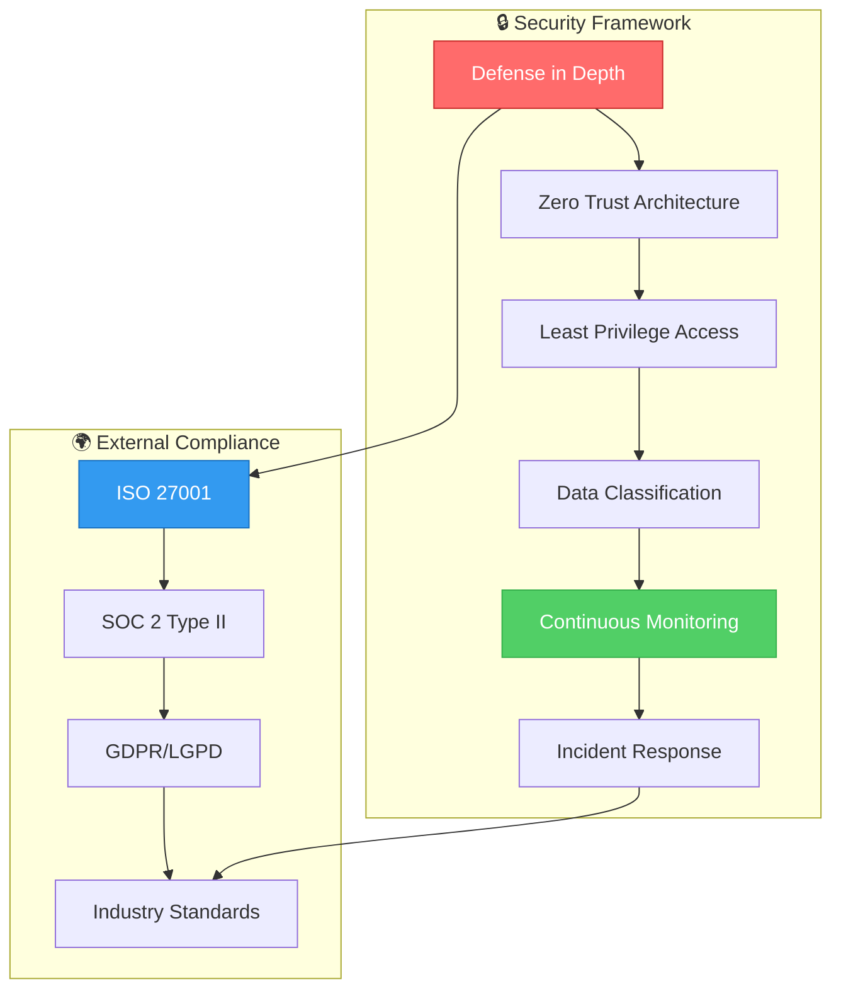
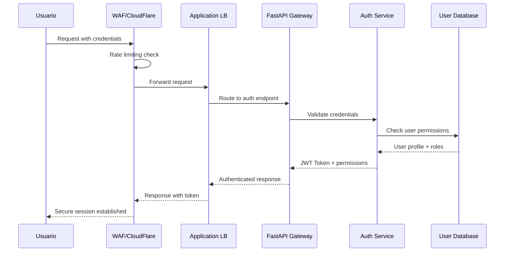

# 🔐 Seguridad y Compliance
**3D Model Crop Health - Marco de Seguridad Empresarial**

---

## 📋 Información del Documento

| Campo | Valor |
|-------|--------|
| **Versión** | 1.0.0 |
| **Fecha** | 2025-10-08 |
| **Audiencia** | CISO, Security Engineers, Compliance Officers |
| **Nivel Clasificación** | Confidencial |
| **Normativas** | ISO 27001, SOC 2, GDPR, LGPD |

---

## 🛡️ Marco de Seguridad General

### **Security by Design Principles**


### **Threat Model**
| Categoria | Amenaza | Probabilidad | Impacto | Mitigación |
|-----------|---------|--------------|---------|------------|
| **External** | DDoS Attack | Alta | Alto | WAF + Rate Limiting |
| **External** | SQL Injection | Media | Crítico | Parameterized Queries |
| **Internal** | Data Exfiltration | Baja | Crítico | DLP + Access Controls |
| **Internal** | Privilege Escalation | Media | Alto | RBAC + MFA |
| **Supply Chain** | Dependency Poisoning | Media | Alto | SCA + Signature Verification |
| **Infrastructure** | Container Escape | Baja | Alto | Runtime Security |

---

## 🔑 Gestión de Identidad y Acceso (IAM)

### **Arquitectura de Autenticación**


### **Role-Based Access Control (RBAC)**
```yaml
# rbac-config.yaml
roles:
  super_admin:
    description: "Full system access"
    permissions:
      - "system:*"
      - "data:*"
      - "user:*"
    
  data_scientist:
    description: "Data analysis and modeling"
    permissions:
      - "data:read"
      - "data:process"
      - "model:read"
      - "model:train"
      - "visualization:*"
    
  field_operator:
    description: "Field data collection and basic analysis"
    permissions:
      - "data:upload"
      - "data:read:own"
      - "visualization:basic"
      - "report:generate:basic"
    
  viewer:
    description: "Read-only access to dashboards"
    permissions:
      - "dashboard:read"
      - "report:read"
      - "visualization:read"

users:
  - username: "admin@eafit.edu.co"
    roles: ["super_admin"]
    mfa_required: true
    
  - username: "alejandro.puerta@eafit.edu.co"
    roles: ["super_admin", "data_scientist"]
    mfa_required: true
    
  - username: "operador@agroprorisk.com"
    roles: ["field_operator"]
    mfa_required: false
```

### **Multi-Factor Authentication (MFA)**
```python
# app/security/mfa.py
import pyotp
import qrcode
from datetime import datetime, timedelta
from typing import Optional

class MFAManager:
    """Gestión de autenticación multifactor."""
    
    def __init__(self, app_name: str = "CropHealth3D"):
        self.app_name = app_name
        self.backup_codes_count = 10
    
    def generate_secret(self, username: str) -> dict:
        """Genera secreto TOTP para nuevo usuario."""
        secret = pyotp.random_base32()
        
        totp_auth = pyotp.totp.TOTP(secret)
        qr_url = totp_auth.provisioning_uri(
            name=username,
            issuer_name=self.app_name
        )
        
        # Generar códigos de backup
        backup_codes = [
            pyotp.random_base32()[:8] 
            for _ in range(self.backup_codes_count)
        ]
        
        return {
            "secret": secret,
            "qr_url": qr_url,
            "backup_codes": backup_codes
        }
    
    def verify_token(self, secret: str, token: str, 
                    window: int = 1) -> bool:
        """Verifica token TOTP."""
        totp = pyotp.TOTP(secret)
        return totp.verify(token, valid_window=window)
    
    def verify_backup_code(self, user_id: str, 
                          backup_code: str) -> bool:
        """Verifica y consume código de backup."""
        # Implementar verificación contra base de datos
        # y marcar código como usado
        pass

class SecureSession:
    """Gestión segura de sesiones."""
    
    def __init__(self, redis_client):
        self.redis = redis_client
        self.session_timeout = timedelta(hours=8)
        self.absolute_timeout = timedelta(hours=24)
    
    def create_session(self, user_id: str, 
                      ip_address: str, 
                      user_agent: str) -> str:
        """Crea sesión segura con metadatos."""
        session_id = pyotp.random_base32()
        
        session_data = {
            "user_id": user_id,
            "created_at": datetime.utcnow().isoformat(),
            "last_activity": datetime.utcnow().isoformat(),
            "ip_address": ip_address,
            "user_agent": user_agent,
            "mfa_verified": False
        }
        
        # Almacenar en Redis con TTL
        self.redis.setex(
            f"session:{session_id}",
            self.absolute_timeout.total_seconds(),
            json.dumps(session_data)
        )
        
        return session_id
    
    def validate_session(self, session_id: str, 
                        ip_address: str) -> Optional[dict]:
        """Valida sesión y detecta anomalías."""
        session_data = self.redis.get(f"session:{session_id}")
        
        if not session_data:
            return None
            
        session = json.loads(session_data)
        
        # Verificar IP (opcional, puede ser problemático con NAT)
        if session["ip_address"] != ip_address:
            logger.warning(f"IP change detected for session {session_id}")
            # Opcional: invalidar sesión o requerir re-autenticación
        
        # Actualizar actividad
        session["last_activity"] = datetime.utcnow().isoformat()
        self.redis.setex(
            f"session:{session_id}",
            self.absolute_timeout.total_seconds(),
            json.dumps(session)
        )
        
        return session
```

---

## 🔒 Encriptación y Protección de Datos

### **Encryption at Rest**
```python
# app/security/encryption.py
from cryptography.fernet import Fernet
from cryptography.hazmat.primitives import hashes
from cryptography.hazmat.primitives.kdf.pbkdf2 import PBKDF2HMAC
import base64
import os

class DataEncryption:
    """Encriptación de datos sensibles."""
    
    def __init__(self, master_key: bytes = None):
        if master_key is None:
            # En producción, obtener de AWS KMS o similar
            master_key = os.environ.get("MASTER_ENCRYPTION_KEY").encode()
        
        self.master_key = master_key
        self._setup_encryption()
    
    def _setup_encryption(self):
        """Configurar encriptación con PBKDF2."""
        salt = b'stable_salt_for_app'  # En prod: aleatorio por env
        kdf = PBKDF2HMAC(
            algorithm=hashes.SHA256(),
            length=32,
            salt=salt,
            iterations=100000,
        )
        key = base64.urlsafe_b64encode(kdf.derive(self.master_key))
        self.cipher = Fernet(key)
    
    def encrypt_data(self, data: str) -> str:
        """Encripta datos sensibles."""
        encrypted = self.cipher.encrypt(data.encode())
        return base64.urlsafe_b64encode(encrypted).decode()
    
    def decrypt_data(self, encrypted_data: str) -> str:
        """Desencripta datos."""
        decoded = base64.urlsafe_b64decode(encrypted_data.encode())
        decrypted = self.cipher.decrypt(decoded)
        return decrypted.decode()

class PIIProtection:
    """Protección de información personal identificable."""
    
    def __init__(self, encryption: DataEncryption):
        self.encryption = encryption
        self.pii_fields = {
            'email', 'phone', 'name', 'address', 
            'coordinates', 'farm_location'
        }
    
    def sanitize_logs(self, log_data: dict) -> dict:
        """Sanitiza logs removiendo PII."""
        sanitized = log_data.copy()
        
        for key, value in sanitized.items():
            if key.lower() in self.pii_fields:
                sanitized[key] = self._mask_pii(str(value))
        
        return sanitized
    
    def _mask_pii(self, value: str) -> str:
        """Enmascara PII para logs."""
        if '@' in value:  # Email
            local, domain = value.split('@')
            return f"{local[:2]}***@{domain}"
        elif value.replace('.', '').replace('-', '').isdigit():  # Phone
            return f"{value[:3]}***{value[-2:]}"
        else:  # General
            return f"{value[:2]}***{value[-1:]}" if len(value) > 3 else "***"
```

### **AWS KMS Integration**
```python
# app/security/kms.py
import boto3
import json
from botocore.exceptions import ClientError

class KMSManager:
    """Gestión de claves con AWS KMS."""
    
    def __init__(self, region: str = 'us-west-2'):
        self.kms = boto3.client('kms', region_name=region)
        self.key_aliases = {
            'data_encryption': 'alias/crop-health-data',
            'config_encryption': 'alias/crop-health-config',
            'backup_encryption': 'alias/crop-health-backup'
        }
    
    def encrypt_data(self, plaintext: str, 
                    key_purpose: str = 'data_encryption') -> dict:
        """Encripta datos con KMS."""
        try:
            response = self.kms.encrypt(
                KeyId=self.key_aliases[key_purpose],
                Plaintext=plaintext.encode()
            )
            
            return {
                'ciphertext_blob': base64.b64encode(
                    response['CiphertextBlob']
                ).decode(),
                'key_id': response['KeyId']
            }
        except ClientError as e:
            logger.error(f"KMS encryption failed: {e}")
            raise
    
    def decrypt_data(self, ciphertext_blob: str) -> str:
        """Desencripta datos con KMS."""
        try:
            decoded_blob = base64.b64decode(ciphertext_blob.encode())
            
            response = self.kms.decrypt(
                CiphertextBlob=decoded_blob
            )
            
            return response['Plaintext'].decode()
        except ClientError as e:
            logger.error(f"KMS decryption failed: {e}")
            raise
    
    def rotate_key(self, key_purpose: str):
        """Rota clave de encriptación."""
        try:
            key_id = self.key_aliases[key_purpose]
            response = self.kms.enable_key_rotation(KeyId=key_id)
            logger.info(f"Key rotation enabled for {key_purpose}")
            return response
        except ClientError as e:
            logger.error(f"Key rotation failed: {e}")
            raise
```

---

## 🚨 Security Monitoring y SIEM

### **Security Event Detection**
```python
# app/security/monitoring.py
import json
import time
from datetime import datetime, timedelta
from typing import Dict, List, Optional
from dataclasses import dataclass
from enum import Enum

class SecurityEventType(Enum):
    """Tipos de eventos de seguridad."""
    LOGIN_FAILURE = "login_failure"
    PRIVILEGE_ESCALATION = "privilege_escalation"
    DATA_ACCESS_ANOMALY = "data_access_anomaly"
    SUSPICIOUS_API_USAGE = "suspicious_api_usage"
    RATE_LIMIT_EXCEEDED = "rate_limit_exceeded"
    UNAUTHORIZED_ACCESS = "unauthorized_access"

@dataclass
class SecurityEvent:
    """Evento de seguridad."""
    event_type: SecurityEventType
    user_id: Optional[str]
    ip_address: str
    user_agent: str
    timestamp: datetime
    details: Dict
    severity: str  # LOW, MEDIUM, HIGH, CRITICAL
    source_system: str

class SecurityMonitor:
    """Monitor de eventos de seguridad."""
    
    def __init__(self, redis_client, alert_webhook: str = None):
        self.redis = redis_client
        self.alert_webhook = alert_webhook
        
        # Umbrales de detección
        self.thresholds = {
            "login_failures": {"count": 5, "window": 300},  # 5 en 5 min
            "api_calls": {"count": 1000, "window": 3600},   # 1000/hora
            "data_access": {"count": 100, "window": 3600}   # 100/hora
        }
    
    def log_security_event(self, event: SecurityEvent):
        """Registra evento de seguridad."""
        event_key = f"sec_event:{event.timestamp.timestamp()}"
        
        event_data = {
            "type": event.event_type.value,
            "user_id": event.user_id,
            "ip_address": event.ip_address,
            "user_agent": event.user_agent,
            "timestamp": event.timestamp.isoformat(),
            "details": event.details,
            "severity": event.severity,
            "source_system": event.source_system
        }
        
        # Almacenar evento
        self.redis.setex(
            event_key,
            86400 * 7,  # 7 días
            json.dumps(event_data)
        )
        
        # Verificar patrones sospechosos
        self._check_anomaly_patterns(event)
        
        # Alertar si es crítico
        if event.severity == "CRITICAL":
            self._send_immediate_alert(event)
    
    def _check_anomaly_patterns(self, event: SecurityEvent):
        """Detecta patrones anómalos."""
        current_time = datetime.utcnow()
        
        # Verificar fallos de login repetidos
        if event.event_type == SecurityEventType.LOGIN_FAILURE:
            pattern_key = f"login_failures:{event.ip_address}"
            count = self.redis.incr(pattern_key)
            self.redis.expire(pattern_key, self.thresholds["login_failures"]["window"])
            
            if count >= self.thresholds["login_failures"]["count"]:
                self._trigger_alert(
                    f"Multiple login failures from {event.ip_address}",
                    "HIGH",
                    {"ip": event.ip_address, "count": count}
                )
        
        # Verificar acceso a datos anómalo
        elif event.event_type == SecurityEventType.DATA_ACCESS_ANOMALY:
            if event.user_id:
                pattern_key = f"data_access:{event.user_id}"
                count = self.redis.incr(pattern_key)
                self.redis.expire(pattern_key, self.thresholds["data_access"]["window"])
                
                if count >= self.thresholds["data_access"]["count"]:
                    self._trigger_alert(
                        f"Anomalous data access by user {event.user_id}",
                        "MEDIUM",
                        {"user_id": event.user_id, "count": count}
                    )
    
    def _trigger_alert(self, message: str, severity: str, details: Dict):
        """Dispara alerta de seguridad."""
        alert = {
            "timestamp": datetime.utcnow().isoformat(),
            "message": message,
            "severity": severity,
            "details": details,
            "system": "CropHealth3D Security Monitor"
        }
        
        # Enviar a webhook si está configurado
        if self.alert_webhook:
            self._send_webhook_alert(alert)
        
        # Log para SIEM
        logger.warning(f"SECURITY_ALERT: {json.dumps(alert)}")
    
    def get_security_report(self, hours: int = 24) -> Dict:
        """Genera reporte de seguridad."""
        end_time = datetime.utcnow()
        start_time = end_time - timedelta(hours=hours)
        
        # Buscar eventos en el rango
        events = []
        cursor = 0
        while True:
            cursor, keys = self.redis.scan(
                cursor=cursor,
                match="sec_event:*",
                count=100
            )
            
            for key in keys:
                event_data = self.redis.get(key)
                if event_data:
                    event = json.loads(event_data)
                    event_time = datetime.fromisoformat(event["timestamp"])
                    
                    if start_time <= event_time <= end_time:
                        events.append(event)
            
            if cursor == 0:
                break
        
        # Generar estadísticas
        report = {
            "period": {
                "start": start_time.isoformat(),
                "end": end_time.isoformat()
            },
            "total_events": len(events),
            "events_by_type": {},
            "events_by_severity": {},
            "top_ip_addresses": {},
            "critical_events": []
        }
        
        for event in events:
            # Por tipo
            event_type = event["type"]
            report["events_by_type"][event_type] = \
                report["events_by_type"].get(event_type, 0) + 1
            
            # Por severidad
            severity = event["severity"]
            report["events_by_severity"][severity] = \
                report["events_by_severity"].get(severity, 0) + 1
            
            # Por IP
            ip = event["ip_address"]
            report["top_ip_addresses"][ip] = \
                report["top_ip_addresses"].get(ip, 0) + 1
            
            # Eventos críticos
            if severity == "CRITICAL":
                report["critical_events"].append(event)
        
        return report
```

### **WAF Configuration**
```yaml
# aws-waf-config.yaml
WebACL:
  Name: CropHealthWAF
  Scope: REGIONAL
  DefaultAction:
    Allow: {}
  
  Rules:
    - Name: AWSManagedRulesCommonRuleSet
      Priority: 1
      OverrideAction:
        None: {}
      Statement:
        ManagedRuleGroupStatement:
          VendorName: AWS
          Name: AWSManagedRulesCommonRuleSet
      VisibilityConfig:
        SampledRequestsEnabled: true
        CloudWatchMetricsEnabled: true
        MetricName: CommonRuleSetMetric
    
    - Name: AWSManagedRulesKnownBadInputsRuleSet
      Priority: 2
      OverrideAction:
        None: {}
      Statement:
        ManagedRuleGroupStatement:
          VendorName: AWS
          Name: AWSManagedRulesKnownBadInputsRuleSet
      VisibilityConfig:
        SampledRequestsEnabled: true
        CloudWatchMetricsEnabled: true
        MetricName: BadInputsRuleSetMetric
    
    - Name: RateLimitRule
      Priority: 3
      Action:
        Block: {}
      Statement:
        RateBasedStatement:
          Limit: 2000  # requests per 5 minutes
          AggregateKeyType: IP
      VisibilityConfig:
        SampledRequestsEnabled: true
        CloudWatchMetricsEnabled: true
        MetricName: RateLimitMetric
    
    - Name: GeoBlockRule
      Priority: 4
      Action:
        Block: {}
      Statement:
        GeoMatchStatement:
          CountryCodes:
            - CN  # China
            - RU  # Russia
            - KP  # North Korea
      VisibilityConfig:
        SampledRequestsEnabled: true
        CloudWatchMetricsEnabled: true
        MetricName: GeoBlockMetric
```

---

## 🛡️ Vulnerability Management

### **Container Security Scanning**
```dockerfile
# security/Dockerfile.security-scan
FROM alpine:latest

# Instalar herramientas de seguridad
RUN apk add --no-cache \
    curl \
    wget \
    git \
    python3 \
    py3-pip

# Instalar Trivy para escaneo de vulnerabilidades
RUN wget -qO- https://raw.githubusercontent.com/aquasecurity/trivy/main/contrib/install.sh | sh

# Instalar safety para dependencias Python
RUN pip3 install safety

# Script de escaneo
COPY scan-security.sh /usr/local/bin/
RUN chmod +x /usr/local/bin/scan-security.sh

ENTRYPOINT ["/usr/local/bin/scan-security.sh"]
```

```bash
#!/bin/bash
# security/scan-security.sh

set -e

IMAGE_NAME=${1:-"3dmodelcrophealth:latest"}
REPORT_DIR=${2:-"/tmp/security-reports"}

mkdir -p "$REPORT_DIR"

echo "🔍 Starting security scan for $IMAGE_NAME..."

# 1. Escaneo de vulnerabilidades con Trivy
echo "📦 Scanning container vulnerabilities..."
trivy image \
  --format json \
  --output "$REPORT_DIR/trivy-report.json" \
  --severity HIGH,CRITICAL \
  "$IMAGE_NAME"

# 2. Escaneo de dependencias Python
echo "🐍 Scanning Python dependencies..."
if [ -f "/app/requirements.txt" ]; then
  safety check \
    --requirements /app/requirements.txt \
    --json \
    --output "$REPORT_DIR/safety-report.json"
fi

# 3. Escaneo de secretos con truffleHog (si está disponible)
echo "🔐 Scanning for secrets..."
if command -v trufflehog &> /dev/null; then
  trufflehog filesystem /app \
    --json \
    --output "$REPORT_DIR/secrets-report.json"
fi

# 4. Generar reporte consolidado
echo "📊 Generating security report..."
python3 << EOF
import json
import os
from datetime import datetime

report_dir = "$REPORT_DIR"
consolidated_report = {
    "scan_timestamp": datetime.utcnow().isoformat(),
    "image_name": "$IMAGE_NAME",
    "vulnerabilities": {"total": 0, "high": 0, "critical": 0},
    "dependency_issues": {"total": 0, "high": 0, "critical": 0},
    "secrets_found": 0,
    "compliance_status": "PASS"
}

# Procesar Trivy
trivy_file = os.path.join(report_dir, "trivy-report.json")
if os.path.exists(trivy_file):
    with open(trivy_file) as f:
        trivy_data = json.load(f)
        for result in trivy_data.get("Results", []):
            for vuln in result.get("Vulnerabilities", []):
                consolidated_report["vulnerabilities"]["total"] += 1
                if vuln.get("Severity") == "HIGH":
                    consolidated_report["vulnerabilities"]["high"] += 1
                elif vuln.get("Severity") == "CRITICAL":
                    consolidated_report["vulnerabilities"]["critical"] += 1

# Procesar Safety
safety_file = os.path.join(report_dir, "safety-report.json")
if os.path.exists(safety_file):
    with open(safety_file) as f:
        safety_data = json.load(f)
        consolidated_report["dependency_issues"]["total"] = len(safety_data)

# Determinar estado de compliance
if (consolidated_report["vulnerabilities"]["critical"] > 0 or 
    consolidated_report["dependency_issues"]["total"] > 10):
    consolidated_report["compliance_status"] = "FAIL"

# Guardar reporte consolidado
with open(os.path.join(report_dir, "security-summary.json"), "w") as f:
    json.dump(consolidated_report, f, indent=2)

print(f"Security scan completed. Status: {consolidated_report['compliance_status']}")
print(f"Critical vulnerabilities: {consolidated_report['vulnerabilities']['critical']}")
print(f"High vulnerabilities: {consolidated_report['vulnerabilities']['high']}")
print(f"Dependency issues: {consolidated_report['dependency_issues']['total']}")
EOF

echo "✅ Security scan completed. Reports saved to $REPORT_DIR"
```

### **Dependency Security**
```yaml
# .github/workflows/security-scan.yml
name: Security Scan

on:
  push:
    branches: [main, develop]
  pull_request:
    branches: [main]
  schedule:
    - cron: '0 2 * * 1'  # Weekly on Monday 2 AM

jobs:
  security-scan:
    runs-on: ubuntu-latest
    
    steps:
    - name: Checkout code
      uses: actions/checkout@v4
    
    - name: Set up Python
      uses: actions/setup-python@v4
      with:
        python-version: '3.10'
    
    - name: Install dependencies
      run: |
        python -m pip install --upgrade pip
        pip install safety bandit semgrep
        pip install -r requirements.txt
    
    - name: Run Safety (dependency check)
      run: |
        safety check --requirements requirements.txt --json --output safety-report.json
      continue-on-error: true
    
    - name: Run Bandit (security linting)
      run: |
        bandit -r app/ -f json -o bandit-report.json
      continue-on-error: true
    
    - name: Run Semgrep (static analysis)
      run: |
        semgrep --config=auto app/ --json --output semgrep-report.json
      continue-on-error: true
    
    - name: Upload security reports
      uses: actions/upload-artifact@v3
      with:
        name: security-reports
        path: |
          safety-report.json
          bandit-report.json
          semgrep-report.json
    
    - name: Security gate check
      run: |
        python scripts/security-gate.py
```

---

## 📋 Compliance y Auditoría

### **ISO 27001 Controls Mapping**
| Control | Descripción | Implementación | Estado |
|---------|-------------|----------------|--------|
| **A.9.1.1** | Access control policy | RBAC + MFA | ✅ Implementado |
| **A.9.2.1** | User registration | User management system | ✅ Implementado |
| **A.9.4.2** | Secure log-on procedures | MFA + Session management | ✅ Implementado |
| **A.10.1.1** | Cryptographic policy | Encryption at rest/transit | ✅ Implementado |
| **A.12.4.1** | Event logging | Security monitoring | ✅ Implementado |
| **A.12.6.1** | Management of vulnerabilities | Automated scanning | ✅ Implementado |
| **A.13.1.1** | Network controls | WAF + Security groups | ✅ Implementado |
| **A.14.2.7** | Outsourced development | Secure SDLC | 🔄 En progreso |

### **Data Protection (GDPR/LGPD)**
```python
# app/compliance/data_protection.py
from enum import Enum
from datetime import datetime, timedelta
from typing import List, Optional, Dict

class DataClassification(Enum):
    """Clasificación de datos según GDPR/LGPD."""
    PUBLIC = "public"
    INTERNAL = "internal"
    CONFIDENTIAL = "confidential"
    PERSONAL = "personal"  # PII
    SENSITIVE_PERSONAL = "sensitive_personal"  # Special categories

class DataRetentionPolicy:
    """Política de retención de datos."""
    
    RETENTION_PERIODS = {
        DataClassification.PUBLIC: timedelta(days=365 * 7),  # 7 años
        DataClassification.INTERNAL: timedelta(days=365 * 5),  # 5 años
        DataClassification.CONFIDENTIAL: timedelta(days=365 * 3),  # 3 años
        DataClassification.PERSONAL: timedelta(days=365 * 2),  # 2 años
        DataClassification.SENSITIVE_PERSONAL: timedelta(days=365 * 1)  # 1 año
    }
    
    def __init__(self, data_store):
        self.data_store = data_store
    
    def should_delete(self, data_record: Dict) -> bool:
        """Determina si un registro debe ser eliminado."""
        classification = DataClassification(data_record.get("classification"))
        created_date = datetime.fromisoformat(data_record.get("created_at"))
        retention_period = self.RETENTION_PERIODS[classification]
        
        return datetime.utcnow() - created_date > retention_period
    
    def anonymize_personal_data(self, data_record: Dict) -> Dict:
        """Anonimiza datos personales."""
        anonymized = data_record.copy()
        
        # Campos que deben ser anonimizados
        pii_fields = {
            "email": lambda x: f"user_{hash(x) % 10000}@anonymous.com",
            "name": lambda x: f"User_{hash(x) % 10000}",
            "phone": lambda x: "***-***-****",
            "coordinates": lambda x: [
                round(float(x[0]), 1),  # Reducir precisión
                round(float(x[1]), 1)
            ]
        }
        
        for field, anonymizer in pii_fields.items():
            if field in anonymized:
                anonymized[field] = anonymizer(anonymized[field])
        
        anonymized["anonymized_at"] = datetime.utcnow().isoformat()
        return anonymized

class GDPRCompliance:
    """Implementación de compliance GDPR."""
    
    def __init__(self, data_store, audit_logger):
        self.data_store = data_store
        self.audit_logger = audit_logger
        self.retention_policy = DataRetentionPolicy(data_store)
    
    def handle_data_subject_request(self, request_type: str, 
                                  subject_id: str) -> Dict:
        """Maneja solicitudes de titulares de datos."""
        
        if request_type == "access":
            return self._handle_access_request(subject_id)
        elif request_type == "portability":
            return self._handle_portability_request(subject_id)
        elif request_type == "erasure":
            return self._handle_erasure_request(subject_id)
        elif request_type == "rectification":
            return self._handle_rectification_request(subject_id)
        else:
            raise ValueError(f"Unknown request type: {request_type}")
    
    def _handle_access_request(self, subject_id: str) -> Dict:
        """Derecho de acceso - Art. 15 GDPR."""
        
        # Buscar todos los datos del titular
        user_data = self.data_store.find_user_data(subject_id)
        
        # Audit log
        self.audit_logger.log_data_access({
            "type": "gdpr_access_request",
            "subject_id": subject_id,
            "timestamp": datetime.utcnow().isoformat(),
            "data_categories": list(user_data.keys())
        })
        
        return {
            "request_type": "access",
            "subject_id": subject_id,
            "data": user_data,
            "processed_at": datetime.utcnow().isoformat()
        }
    
    def _handle_erasure_request(self, subject_id: str) -> Dict:
        """Derecho al olvido - Art. 17 GDPR."""
        
        # Verificar si aplican excepciones legales
        legal_exceptions = self._check_erasure_exceptions(subject_id)
        
        if legal_exceptions:
            return {
                "request_type": "erasure",
                "subject_id": subject_id,
                "status": "rejected",
                "reason": "Legal exceptions apply",
                "exceptions": legal_exceptions,
                "processed_at": datetime.utcnow().isoformat()
            }
        
        # Proceder con eliminación
        deleted_records = self.data_store.delete_user_data(subject_id)
        
        # Audit log
        self.audit_logger.log_data_deletion({
            "type": "gdpr_erasure_request",
            "subject_id": subject_id,
            "timestamp": datetime.utcnow().isoformat(),
            "deleted_records": len(deleted_records)
        })
        
        return {
            "request_type": "erasure",
            "subject_id": subject_id,
            "status": "completed",
            "deleted_records": len(deleted_records),
            "processed_at": datetime.utcnow().isoformat()
        }
    
    def generate_privacy_report(self) -> Dict:
        """Genera reporte de privacidad para DPO."""
        
        return {
            "report_date": datetime.utcnow().isoformat(),
            "data_processing_activities": self._get_processing_activities(),
            "data_subject_requests": self._get_dsr_statistics(),
            "data_breaches": self._get_breach_statistics(),
            "retention_compliance": self._check_retention_compliance(),
            "consent_management": self._get_consent_statistics()
        }
```

---

## 🚨 Incident Response

### **Security Incident Playbook**
```yaml
# incident-response/playbooks/security-incident.yaml
playbook:
  name: "Security Incident Response"
  version: "1.0"
  
  triggers:
    - security_alert_critical
    - data_breach_detected
    - unauthorized_access
    - malware_detected
  
  phases:
    preparation:
      duration: "0 minutes"
      actions:
        - activate_incident_team
        - establish_communication_channels
        - secure_evidence_collection
    
    identification:
      duration: "15 minutes"
      actions:
        - assess_incident_scope
        - classify_incident_type
        - determine_affected_systems
        - initial_impact_assessment
    
    containment:
      duration: "30 minutes"
      actions:
        - isolate_affected_systems
        - preserve_evidence
        - implement_temporary_controls
        - notify_stakeholders
    
    eradication:
      duration: "2 hours"
      actions:
        - remove_malicious_code
        - patch_vulnerabilities
        - update_security_controls
        - verify_system_integrity
    
    recovery:
      duration: "4 hours"
      actions:
        - restore_from_clean_backups
        - monitor_for_anomalies
        - validate_security_controls
        - gradual_service_restoration
    
    lessons_learned:
      duration: "1 week"
      actions:
        - conduct_post_incident_review
        - update_documentation
        - improve_security_controls
        - provide_team_training

  escalation_matrix:
    severity_1_critical:
      notify_immediately:
        - alejandro.puerta@eafit.edu.co
        - coordinador.sistemas@eafit.edu.co
        - soporte.agroprorisk@eafit.edu.co
      timeframe: "5 minutes"
    
    severity_2_high:
      notify_within:
        - alejandro.puerta@eafit.edu.co
        - coordinador.sistemas@eafit.edu.co
      timeframe: "15 minutes"
    
    severity_3_medium:
      notify_within:
        - alejandro.puerta@eafit.edu.co
      timeframe: "1 hour"
```

---

## 📞 Contactos de Seguridad

| Rol | Contacto | Responsabilidad |
|-----|----------|-----------------|
| **Desarrollador Principal** | alejandro.puerta@eafit.edu.co | Implementación y estrategia de seguridad |
| **Coordinador Técnico** | coordinador.sistemas@eafit.edu.co | Supervisión de seguridad |
| **Soporte de Incidentes** | alejandro.puerta@eafit.edu.co | Respuesta a incidentes |
| **Compliance Institucional** | compliance@eafit.edu.co | Auditorías y normativas |
| **Protección de Datos** | privacidad@eafit.edu.co | GDPR/LGPD compliance |

---

*Marco de seguridad empresarial para protección integral.*

**Próxima Revisión:** 2025-11-08  
**Clasificación:** Confidencial  
**Aprobado por:** CISO | Security Architect