# ⚙️ Manual de Operaciones
**AgroProRisk - Guía Operacional del Sistema**

---

## 📋 Información del Documento

| Campo | Valor |
|-------|--------|
| **Versión** | 1.0.0 |
| **Fecha** | 2025-10-08 |
| **Audiencia** | Operadores del Sistema, Evaluadores Técnicos |
| **Nivel Técnico** | Operacional |
| **Estado del Sistema** | En Producción |

---

## 🎯 Visión General Operacional

### **Estado Actual del Sistema**
El sistema **AgroProRisk** está completamente operativo y desplegado en la infraestructura de **AWS**, proporcionando servicios estables a través de los dominios:
- 🌐 **www.agroprorisk.com** - Landing page principal
- 🖥️ **desktop.agroprorisk.com** - Interfaz de escritorio
- 📱 **mobile.agroprorisk.com** - Interfaz móvil

### **Arquitectura Operacional**

```mermaid
graph TB
    subgraph "🌍 Internet"
        USERS[👥 Usuarios]
    end
    
    subgraph "☁️ AWS Infrastructure"
        ALB[🔀 Application Load Balancer]
        
        subgraph "📦 ECS Cluster"
            GATEWAY[🚪 FastAPI Gateway<br/>:8000]
            DESKTOP[🖥️ Desktop Worker<br/>:8501]
            MOBILE[📱 Mobile Worker<br/>:8502]
        end
        
        subgraph "📊 Monitoring"
            CW[📈 CloudWatch]
            LOGS[📝 CloudWatch Logs]
        end
        
        subgraph "💾 Storage"
            S3[🗄️ S3 Buckets]
            ECR[📦 ECR Registry]
        end
    end
    
    USERS --> ALB
    ALB --> GATEWAY
    GATEWAY --> DESKTOP
    GATEWAY --> MOBILE
    
    GATEWAY --> CW
    DESKTOP --> CW
    MOBILE --> CW
    
    GATEWAY --> LOGS
    DESKTOP --> LOGS
    MOBILE --> LOGS
    
    style GATEWAY fill:#e8f5e8,stroke:#388e3c
    style DESKTOP fill:#e3f2fd,stroke:#1976d2
    style MOBILE fill:#fff3e0,stroke:#f57c00
```


---

## 🚀 Operaciones de Startup

### **Secuencia de Inicio del Sistema**
```bash
# 1. Verificar estado de la infraestructura
aws ecs describe-clusters --clusters agroprorisk-production

# 2. Verificar servicios en ejecución
aws ecs describe-services \
    --cluster agroprorisk-production \
    --services agroprorisk-production-service

# 3. Verificar health checks
curl -f https://www.agroprorisk.com/health
curl -f https://desktop.agroprorisk.com/
curl -f https://mobile.agroprorisk.com/

# 4. Verificar logs recientes
aws logs tail /ecs/agroprorisk --since 10m
```

### **Startup Checklist**
- [ ] ✅ **ECS Cluster** activo y saludable
- [ ] ✅ **Load Balancer** respondiendo correctamente
- [ ] ✅ **Gateway Service** (puerto 8000) operativo
- [ ] ✅ **Desktop Worker** (puerto 8501) operativo
- [ ] ✅ **Mobile Worker** (puerto 8502) operativo
- [ ] ✅ **Health checks** pasando en todos los servicios
- [ ] ✅ **SSL Certificates** válidos y no expirados
- [ ] ✅ **DNS Resolution** funcionando correctamente

---

## 📊 Monitoreo y Observabilidad

### **Métricas Clave de Sistema**
```json
{
  "system_health": {
    "gateway_uptime": "99.9%",
    "desktop_worker_uptime": "99.8%",
    "mobile_worker_uptime": "99.7%",
    "average_response_time": "1.2s",
    "error_rate": "<0.1%"
  },
  "performance_metrics": {
    "concurrent_users": "25-75",
    "peak_load_time": "14:00-16:00 COT",
    "data_processing_time": "3.8s avg",
    "memory_utilization": "60-75%",
    "cpu_utilization": "40-60%"
  }
}
```

### **CloudWatch Dashboards**
```bash
# Métricas principales a monitorear
aws cloudwatch get-metric-statistics \
    --namespace AWS/ECS \
    --metric-name CPUUtilization \
    --dimensions Name=ServiceName,Value=agroprorisk-production-service \
    --start-time $(date -u -d '1 hour ago' +%Y-%m-%dT%H:%M:%S) \
    --end-time $(date -u +%Y-%m-%dT%H:%M:%S) \
    --period 300 \
    --statistics Average

# Métricas de Application Load Balancer
aws cloudwatch get-metric-statistics \
    --namespace AWS/ApplicationELB \
    --metric-name RequestCount \
    --dimensions Name=LoadBalancer,Value=app/agroprorisk-production-alb/xxx \
    --start-time $(date -u -d '1 hour ago' +%Y-%m-%dT%H:%M:%S) \
    --end-time $(date -u +%Y-%m-%dT%H:%M:%S) \
    --period 300 \
    --statistics Sum
```

### **Alertas Configuradas**
| Alerta | Threshold | Acción |
|--------|-----------|--------|
| **High CPU** | >80% por 5 min | Email a alejandro.puerta@eafit.edu.co |
| **High Memory** | >85% por 5 min | Email + SMS |
| **High Error Rate** | >5% por 2 min | Email inmediato |
| **Service Down** | Health check fail | Email + SMS inmediato |
| **SSL Expiry** | <30 días | Email semanal |

---

## 🔧 Procedimientos de Mantenimiento

### **Mantenimiento Rutinario**
```bash
#!/bin/bash
# scripts/maintenance.sh

echo "🔧 Iniciando mantenimiento rutinario..."

# 1. Verificar estado de contenedores
echo "📦 Verificando contenedores..."
aws ecs list-tasks --cluster agroprorisk-production

# 2. Limpiar logs antiguos (>30 días)
echo "🧹 Limpiando logs antiguos..."
aws logs delete-log-group --log-group-name /ecs/agroprorisk-old

# 3. Verificar uso de disco en S3
echo "💾 Verificando uso de S3..."
aws s3 ls s3://agroprorisk-data --recursive --human-readable --summarize

# 4. Actualizar certificados SSL si es necesario
echo "🔐 Verificando certificados SSL..."
openssl s_client -connect www.agroprorisk.com:443 -servername www.agroprorisk.com </dev/null 2>/dev/null | openssl x509 -noout -dates

# 5. Backup de configuraciones
echo "💾 Realizando backup de configuraciones..."
aws ecs describe-task-definition --task-definition agroprorisk-task > backup/task-def-$(date +%Y%m%d).json

echo "✅ Mantenimiento completado"
```

### **Procedimientos de Backup**
```bash
# Backup diario automatizado
0 2 * * * /opt/scripts/backup-daily.sh

# backup-daily.sh
#!/bin/bash
DATE=$(date +%Y%m%d)

# Backup de datos de aplicación
aws s3 sync s3://agroprorisk-data s3://agroprorisk-backup/data/$DATE/

# Backup de configuraciones ECS
aws ecs describe-services --cluster agroprorisk-production > /tmp/ecs-services-$DATE.json
aws s3 cp /tmp/ecs-services-$DATE.json s3://agroprorisk-backup/configs/

# Backup de métricas de CloudWatch (exports)
aws logs create-export-task \
    --log-group-name /ecs/agroprorisk \
    --from $(date -d '1 day ago' +%s)000 \
    --to $(date +%s)000 \
    --destination agroprorisk-backup \
    --destination-prefix logs/$DATE/
```

---

## 🚨 Procedimientos de Emergencia

### **Incident Response Runbook**
```yaml
severity_1_critical:
  description: "Sistema completamente inaccesible"
  response_time: "5 minutos"
  actions:
    - check_alb_health: "aws elbv2 describe-target-health"
    - check_ecs_services: "aws ecs describe-services"
    - verify_dns: "nslookup www.agroprorisk.com"
    - contact: "alejandro.puerta@eafit.edu.co"
  
severity_2_high:
  description: "Degradación significativa de performance"
  response_time: "15 minutos"
  actions:
    - check_metrics: "CloudWatch dashboard review"
    - scale_services: "aws ecs update-service --desired-count 3"
    - monitor_recovery: "Continuous monitoring for 30min"

severity_3_medium:
  description: "Problemas menores o warnings"
  response_time: "1 hora"
  actions:
    - investigate_logs: "aws logs filter-log-events"
    - document_issue: "Create incident report"
    - schedule_fix: "Plan maintenance window"
```

### **Rollback Procedures**
```bash
#!/bin/bash
# scripts/emergency-rollback.sh

echo "🚨 Iniciando rollback de emergencia..."

# 1. Obtener la versión anterior
PREVIOUS_TASK_DEF=$(aws ecs list-task-definitions \
    --family-prefix agroprorisk-task \
    --status ACTIVE \
    --sort DESC \
    --query 'taskDefinitionArns[1]' \
    --output text)

echo "📋 Rollback a: $PREVIOUS_TASK_DEF"

# 2. Actualizar servicio a versión anterior
aws ecs update-service \
    --cluster agroprorisk-production \
    --service agroprorisk-production-service \
    --task-definition $PREVIOUS_TASK_DEF

# 3. Esperar estabilización
echo "⏳ Esperando estabilización del servicio..."
aws ecs wait services-stable \
    --cluster agroprorisk-production \
    --services agroprorisk-production-service

# 4. Verificar health
echo "🏥 Verificando health post-rollback..."
sleep 30
curl -f https://www.agroprorisk.com/health

echo "✅ Rollback completado"
```

---

## 📈 Gestión de Capacidad

### **Scaling Automático**
```json
{
  "auto_scaling_policy": {
    "metric": "CPUUtilization",
    "target_value": 60,
    "scale_out": {
      "threshold": "70%",
      "cooldown": "300s",
      "step": "+1 task"
    },
    "scale_in": {
      "threshold": "30%",
      "cooldown": "600s",
      "step": "-1 task"
    }
  },
  "capacity_limits": {
    "min_tasks": 1,
    "max_tasks": 5,
    "desired_tasks": 2
  }
}
```

### **Manual Scaling**
```bash
# Escalar hacia arriba (más recursos)
aws ecs update-service \
    --cluster agroprorisk-production \
    --service agroprorisk-production-service \
    --desired-count 3

# Escalar hacia abajo (menos recursos)
aws ecs update-service \
    --cluster agroprorisk-production \
    --service agroprorisk-production-service \
    --desired-count 1

# Verificar estado del scaling
aws ecs describe-services \
    --cluster agroprorisk-production \
    --services agroprorisk-production-service \
    --query 'services[0].{Running:runningCount,Desired:desiredCount,Pending:pendingCount}'
```

---

## 🔍 Troubleshooting Común

### **Problemas Frecuentes y Soluciones**

| Problema | Síntomas | Diagnóstico | Solución |
|----------|----------|-------------|----------|
| **Gateway No Responde** | 502/503 errors | `curl https://www.agroprorisk.com/health` | Restart ECS service |
| **Worker Desconectado** | Desktop/Mobile no cargan | Check ECS task health | Redeploy worker tasks |
| **Performance Lenta** | Response time >5s | CloudWatch metrics | Scale up resources |
| **SSL Certificate Issues** | Browser security warnings | `openssl s_client` check | Renew certificates |
| **Memory Leaks** | Gradual performance degradation | Memory utilization trending up | Restart tasks |

### **Comandos de Diagnóstico**
```bash
# Health check completo del sistema
#!/bin/bash
echo "🔍 Diagnóstico completo del sistema..."

# 1. Verificar conectividad básica
echo "1. Conectividad básica:"
curl -I https://www.agroprorisk.com/health
curl -I https://desktop.agroprorisk.com/
curl -I https://mobile.agroprorisk.com/

# 2. Verificar estado ECS
echo "2. Estado ECS:"
aws ecs describe-clusters --clusters agroprorisk-production --query 'clusters[0].{Status:status,ActiveServices:activeServicesCount,RunningTasks:runningTasksCount}'

# 3. Verificar targets del Load Balancer
echo "3. Estado Load Balancer:"
aws elbv2 describe-target-health --target-group-arn arn:aws:elasticloadbalancing:region:account:targetgroup/agroprorisk-tg/xxx

# 4. Verificar logs recientes
echo "4. Logs recientes (últimos 5 minutos):"
aws logs filter-log-events \
    --log-group-name /ecs/agroprorisk \
    --start-time $(($(date +%s) - 300))000 \
    --filter-pattern "ERROR"

# 5. Verificar métricas de performance
echo "5. Métricas de performance:"
aws cloudwatch get-metric-statistics \
    --namespace AWS/ECS \
    --metric-name CPUUtilization \
    --dimensions Name=ServiceName,Value=agroprorisk-production-service \
    --start-time $(date -u -d '10 minutes ago' +%Y-%m-%dT%H:%M:%S) \
    --end-time $(date -u +%Y-%m-%dT%H:%M:%S) \
    --period 300 \
    --statistics Average \
    --query 'Datapoints[0].Average'
```

---

## 📞 Contactos Operacionales

| Tipo de Incidente | Contacto | Disponibilidad | Escalación |
|-------------------|----------|----------------|------------|
| **Incidentes Críticos** | alejandro.puerta@eafit.edu.co | 24/7 (bajo demanda) | Supervisor académico |
| **Problemas de Performance** | alejandro.puerta@eafit.edu.co | Horario laboral | Coordinación técnica |
| **Mantenimiento Planificado** | alejandro.puerta@eafit.edu.co | Horario laboral | Universidad EAFIT |
| **Consultas Operacionales** | soporte.agroprorisk@eafit.edu.co | 9:00-17:00 COT | Alejandro Puerta |

---

## 📚 Referencias y Documentación

### **Runbooks Adicionales**
- 🔧 **Deployment Guide:** [06_Deployment_Guide.md](./06_Deployment_Guide.md)
- 🔐 **Security Procedures:** [07_Security_Framework.md](./07_Security_Framework.md)
- 🧪 **Testing Procedures:** [08_Testing_Strategy.md](./08_Testing_Strategy.md)

### **Links Útiles**
- 📊 **CloudWatch Dashboard:** [AWS Console - CloudWatch](https://console.aws.amazon.com/cloudwatch)
- 📦 **ECS Console:** [AWS Console - ECS](https://console.aws.amazon.com/ecs)
- 🔀 **Load Balancer Console:** [AWS Console - EC2 Load Balancers](https://console.aws.amazon.com/ec2/v2/home#LoadBalancers)

---

*Manual de operaciones para el sistema AgroProRisk en producción. Sistema operativo y monitoreado 24/7.*

**Estado:** Sistema en Producción  
**Desarrollado por:** Alejandro Puerta - Senior DevOps Engineer | Universidad EAFIT