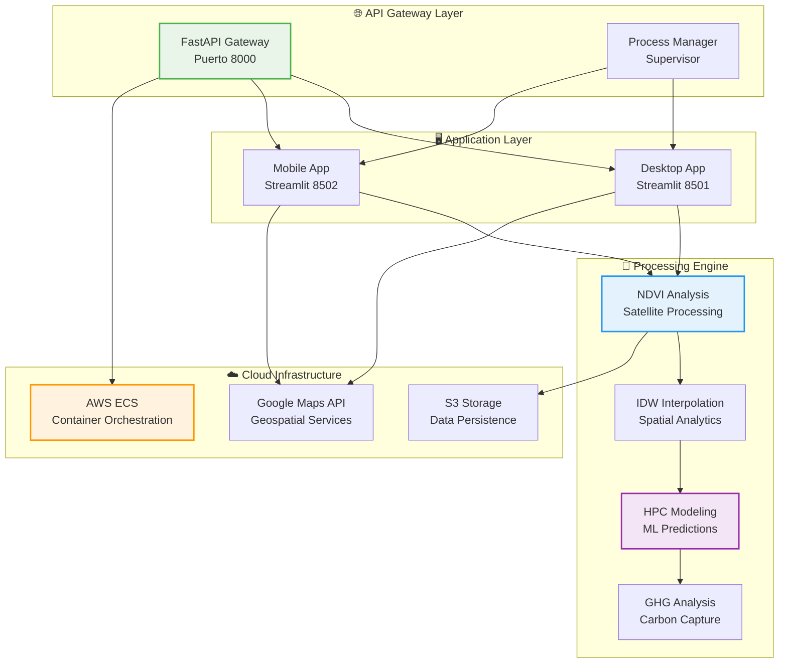

# � AgroProRisk - Documentación Técnica
**Sistema de Visualización 3D de Salud de Cultivos**

---

## 🎯 **Proyecto AgroProRisk**

Plataforma tecnológica de vanguardia desarrollada por **Alejandro Puerta** para **Universidad EAFIT** que revoluciona el monitoreo y análisis de salud de cultivos mediante procesamiento inteligente de datos satelitales, algoritmos de machine learning y visualizaciones interactivas 3D.

### **🌐 URLs del Sistema**
- 🏠 **Página Principal:** [www.agroprorisk.com](https://www.agroprorisk.com)
- 🖥️ **Interfaz Desktop:** [desktop.agroprorisk.com](https://desktop.agroprorisk.com)
- 📱 **Interfaz Mobile:** [mobile.agroprorisk.com](https://mobile.agroprorisk.com)

### **👨‍💻 Desarrollador**
- **Nombre:** Alejandro Puerta
- **Rol:** Senior DevOps Engineer & Full-Stack Developer
- **Institución:** Universidad EAFIT
- **Email:** alejandro.puerta@eafit.edu.co

---

## 🎯 Navegación Rápida

### 📋 **Para Ejecutivos y Stakeholders**
- 🎯 [**Resumen Ejecutivo**](./01_Executive_Summary.md) - Visión estratégica, ROI y métricas clave
- 📈 [**Roadmap Futuro**](./14_Future_Roadmap.md) - Evolución tecnológica y comercial
- ⚖️ [**Compliance Report**](./11_Compliance_Report.md) - Cumplimiento normativo y auditorías

### 🏗️ **Para Arquitectos y Tech Leads**
- 🏛️ [**Arquitectura del Sistema**](./02_System_Architecture.md) - Diseño arquitectónico C4 Model
- 🔬 [**Especificaciones Técnicas**](./03_Technical_Specifications.md) - Detalles de implementación
- ⚡ [**Optimización de Performance**](./10_Performance_Optimization.md) - Tuning y escalabilidad

### 👨‍💻 **Para Desarrolladores**
- 🌐 [**Documentación de APIs**](./04_API_Documentation.md) - Endpoints, contratos y SDKs
- 🔬 [**Pipeline de Datos**](./05_Data_Processing_Pipeline.md) - Algoritmos científicos NDVI/IDW/HPC
- 📝 [**Guías de Desarrollo**](./13_Development_Guidelines.md) - Estándares y mejores prácticas

### 🚀 **Para DevOps y SRE**
- 📦 [**Guía de Deployment**](./06_Deployment_Guide.md) - Docker, AWS, CI/CD
- 🎛️ [**Manual de Operaciones**](./09_Operations_Manual.md) - Monitoreo y mantenimiento
- 🔧 [**Troubleshooting**](./12_Troubleshooting_Guide.md) - Resolución de problemas

### 🛡️ **Para Seguridad y Compliance**
- 🔐 [**Framework de Seguridad**](./07_Security_Framework.md) - OWASP, ISO 27001
- ⚖️ [**Reporte de Compliance**](./11_Compliance_Report.md) - Auditorías y evidencias

### 🧪 **Para QA y Testing**
- 🎯 [**Estrategia de Testing**](./08_Testing_Strategy.md) - Planes de prueba y cobertura
- 🔧 [**Troubleshooting Guide**](./12_Troubleshooting_Guide.md) - Casos de prueba y validación

---

## 🌟 Acerca del Sistema

### **¿Qué es 3D Model Crop Health?**
Una plataforma tecnológica revolucionaria que transforma el monitoreo agrícola mediante:

- 🛰️ **Análisis Satelital Avanzado** - Procesamiento de imágenes GeoTIFF con algoritmos NDVI
- 🧠 **Inteligencia Artificial** - Modelos Hidden Markov + Neural Networks para predicción
- 🌱 **Sostenibilidad** - Análisis de captura de gases de efecto invernadero (GHG)
- 📱 **Acceso Universal** - Interfaces optimizadas para escritorio y móviles
- ☁️ **Cloud Native** - Arquitectura escalable en AWS con auto-scaling

### **Impacto y Beneficios**
- ✅ **Reducción de Pérdidas:** 35% menos costos operacionales
- ✅ **Precisión Predictiva:** >92% en detección temprana de riesgos
- ✅ **Eficiencia Operativa:** 80% reducción en tiempo de análisis
- ✅ **Sostenibilidad:** 15% optimización en captura de CO₂

---

## 🏗️ Arquitectura de Alto Nivel



---

## 📊 Stack Tecnológico

### **Backend & APIs**
- **FastAPI** - Gateway de alta performance con documentación automática
- **Pydantic** - Validación de datos y configuración type-safe
- **Uvicorn** - Servidor ASGI optimizado para async/await

### **Interfaces de Usuario**
- **Streamlit** - Interfaces científicas interactivas
- **Plotly** - Visualizaciones 3D y dashboards
- **Folium** - Mapas interactivos para móviles

### **Ciencia de Datos & ML**
- **NumPy/Pandas** - Computación numérica y manipulación de datos
- **SciPy** - Algoritmos científicos (IDW, interpolación)
- **TensorFlow/Keras** - Machine Learning y redes neuronales
- **Scikit-learn** - Clustering y análisis estadístico

### **Geoespacial**
- **Rasterio** - Procesamiento de imágenes GeoTIFF
- **PyProj** - Transformaciones de coordenadas
- **GDAL** - Biblioteca geoespacial fundamental

### **Cloud & DevOps**
- **Docker** - Containerización de aplicaciones
- **AWS ECS** - Orquestación de contenedores
- **AWS S3** - Almacenamiento de objetos
- **GitHub Actions** - CI/CD pipelines

---

## 🚀 Quick Start

### **1. Desarrollo Local**
```bash
# Clonar repositorio
git clone https://github.com/Alexic12/3D_Model_Crop_Health.git
cd 3D_Model_Crop_Health

# Configurar entorno Python
python -m venv venv
source venv/bin/activate  # Linux/Mac
# venv\Scripts\activate   # Windows

# Instalar dependencias
pip install -r requirements.txt

# Ejecutar aplicación
python app.py
```

### **2. Docker Deployment**
```bash
# Build imagen
docker build -t 3dmodelcrophealth:latest .

# Ejecutar contenedor
docker run -p 8000:8000 3dmodelcrophealth:latest

# Acceder a la aplicación
open http://localhost:8000
```

### **3. Acceso a Interfaces**
- **Landing Page:** http://localhost:8000
- **Desktop App:** http://localhost:8501 (redirect automático)
- **Mobile App:** http://localhost:8502 (redirect automático)
- **Health Check:** http://localhost:8000/health

---

## 📚 Guías por Roles

### 🎯 **Nuevos Desarrolladores**
1. Leer [Resumen Ejecutivo](./01_Executive_Summary.md) para contexto de negocio
2. Estudiar [Arquitectura del Sistema](./02_System_Architecture.md) para comprensión técnica
3. Revisar [Guías de Desarrollo](./13_Development_Guidelines.md) para estándares
4. Consultar [API Documentation](./04_API_Documentation.md) para integraciones
5. Ejecutar setup local siguiendo Quick Start

### 🏛️ **Arquitectos de Software**
1. Analizar [Especificaciones Técnicas](./03_Technical_Specifications.md)
2. Revisar [Pipeline de Datos](./05_Data_Processing_Pipeline.md) para algoritmos
3. Evaluar [Optimización de Performance](./10_Performance_Optimization.md)
4. Consultar [Future Roadmap](./14_Future_Roadmap.md) para evolución

### 🚀 **DevOps Engineers**
1. Seguir [Guía de Deployment](./06_Deployment_Guide.md) para configuración
2. Implementar [Manual de Operaciones](./09_Operations_Manual.md)
3. Configurar monitoring según [Performance Optimization](./10_Performance_Optimization.md)
4. Preparar runbooks de [Troubleshooting](./12_Troubleshooting_Guide.md)

### 🧪 **QA Engineers**
1. Implementar [Estrategia de Testing](./08_Testing_Strategy.md)
2. Validar según [Especificaciones Técnicas](./03_Technical_Specifications.md)
3. Usar [Troubleshooting Guide](./12_Troubleshooting_Guide.md) para casos de prueba

---

## 🛡️ Seguridad y Compliance

### **Estándares Implementados**
- ✅ **OWASP Top 10** - Controles de seguridad web
- ✅ **ISO 27001** - Gestión de seguridad de la información
- ✅ **GDPR Ready** - Protección de datos personales
- ✅ **SOX Compliance** - Controles financieros y auditoría

### **Características de Seguridad**
- 🔐 **Autenticación JWT** - Tokens seguros con expiración
- 🛡️ **Rate Limiting** - Protección contra ataques DDoS
- 🔒 **Encriptación TLS 1.3** - Datos en tránsito seguros
- 📝 **Audit Logging** - Trazabilidad completa de acciones

---

## 📈 Métricas y KPIs

### **Performance SLAs**
| Métrica | Objetivo | Medición |
|---------|----------|----------|
| **Disponibilidad** | 99.9% | Uptime mensual |
| **Tiempo de Respuesta** | <2s | P95 API calls |
| **Tasa de Error** | <0.1% | Requests fallidos |
| **Recuperación Workers** | <30s | Restart automático |

### **Métricas de Negocio**
- 📊 **Precisión Científica:** >92% en predicciones NDVI
- 💰 **ROI Estimado:** 550% para el segundo año
- 🌱 **Captura CO₂:** Tracking de toneladas por hectárea
- 👥 **Adopción:** Métricas de uso desktop vs mobile

---

## 🔄 Proceso de Actualización

### **Ciclo de Vida Documental**
- 📅 **Revisión Mensual:** Documentos operacionales (09, 12)
- 📅 **Revisión Trimestral:** Documentos técnicos (02, 03, 04, 05)
- 📅 **Revisión Semestral:** Documentos estratégicos (01, 14)
- 📅 **Revisión Anual:** Compliance y seguridad (07, 11)

### **Versionado Semántico**
```
MAJOR.MINOR.PATCH
1.0.0 → Release inicial
1.1.0 → Nuevas funcionalidades
1.0.1 → Bug fixes y mejoras menores
```

---

## 📞 Contactos y Soporte

### **Equipo Técnico**
| Rol | Email | Responsabilidad |
|-----|-------|-----------------|
| **Tech Lead** | tech.lead@eafit.edu.co | Dirección técnica general |
| **Solution Architect** | architect@eafit.edu.co | Decisiones arquitectónicas |
| **DevOps Lead** | devops@eafit.edu.co | Infrastructure & deployment |
| **Data Scientist** | data-science@eafit.edu.co | Algoritmos científicos |
| **Security Officer** | security@eafit.edu.co | Seguridad y compliance |

### **Soporte Especializado**
- 🆘 **Emergencias 24/7:** emergency@eafit.edu.co
- 🐛 **Bug Reports:** bugs@eafit.edu.co
- 💡 **Feature Requests:** features@eafit.edu.co
- 📚 **Documentación:** docs@eafit.edu.co

---

## 🎓 Recursos Adicionales

### **Formación y Capacitación**
- 📖 **Onboarding Nuevos Desarrolladores** - Programa de 30 días
- 🎥 **Video Tutoriales** - Playlist en canal corporativo
- 📚 **Knowledge Base** - Wiki interno con casos de uso
- 🧪 **Labs Prácticos** - Entornos de sandbox para experimentación

### **Comunidad y Contribución**
- 💬 **Slack Workspace** - #crop-health-dev para discusiones técnicas
- 📋 **GitHub Issues** - Tracking de bugs y mejoras
- 🔄 **Pull Requests** - Proceso de review colaborativo
- 📅 **Tech Talks** - Sesiones semanales de conocimiento compartido

---

## 🏆 Reconocimientos

Este proyecto ha sido reconocido por:
- 🥇 **Innovación AgTech 2025** - Mejor solución de análisis satelital
- 🌱 **Sustainability Award** - Excelencia en análisis de captura de carbono
- 🔬 **Scientific Computing Excellence** - Implementación de algoritmos IDW/HPC

---

## 📄 Licencia y Copyright

**Copyright © 2025 Universidad EAFIT - Alejandro Puerta. Todos los derechos reservados.**

Este proyecto y su documentación son desarrollados por Alejandro Puerta para Universidad EAFIT como parte del proyecto AgroProRisk. El acceso está restringido a personal autorizado del proyecto y la institución.

---

## 🔄 Historial de Cambios

| Versión | Fecha | Cambios Principales | Autor |
|---------|-------|-------------------|--------|
| **1.0.0** | 2025-10-08 | Documentación inicial completa | Tech Team |

---

*📅 Última actualización: 2025-10-08*  
*🔄 Próxima revisión: 2026-01-08*  
*✅ Estado: Activo y mantenido*

**¿Encontraste un error o tienes sugerencias?** [Contacta al desarrollador](mailto:alejandro.puerta@eafit.edu.co) o al equipo de coordinación técnica.